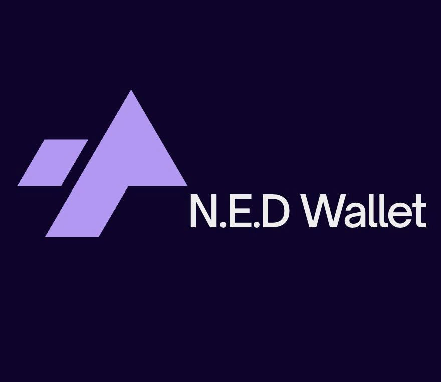
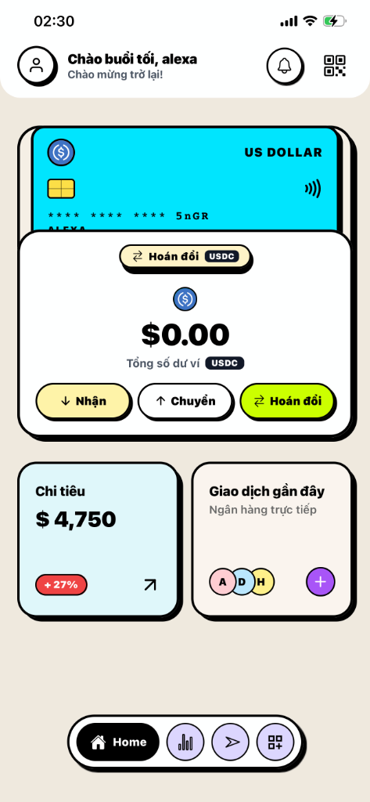
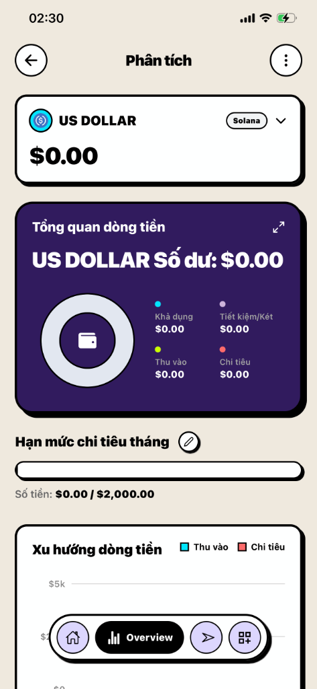
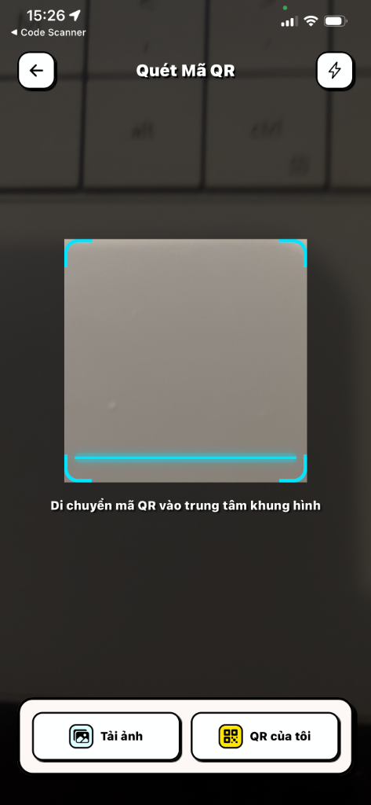
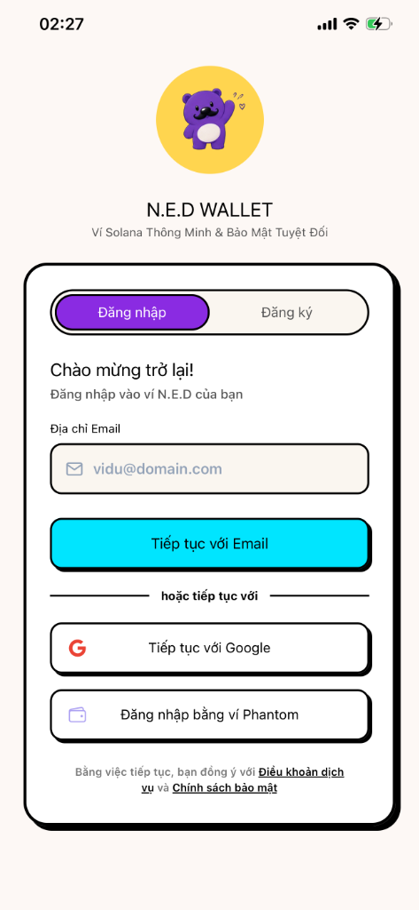
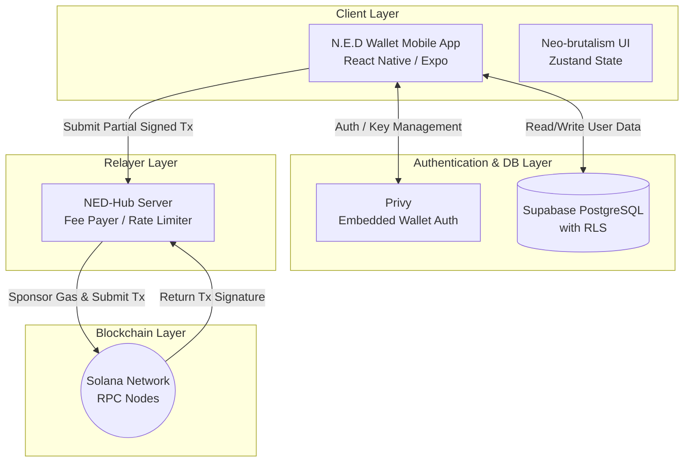
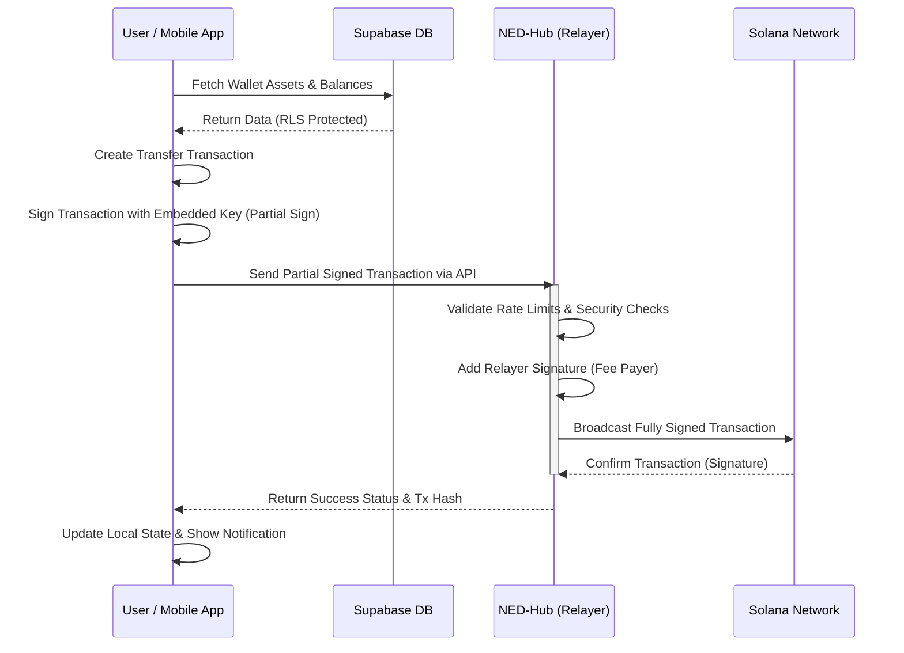

> A Next-Generation Web3 Smart Wallet on Solana Network

[](https://solana.com/)
[](https://reactnative.dev/)
[](https://www.typescriptlang.org/)
[](https://supabase.com/)

**N.E.D Wallet** is a smart Web3 wallet built on the Solana blockchain, focusing on delivering a seamless Web2.5 user experience. It combines a bold Neo-brutalism design language with robust stablecoin asset management and gasless transactions.

---

## Table of Contents

- [Overview](#overview)
- [UI Showcase](#ui-showcase)
- [Features](#features)
- [Tech Stack](#tech-stack)
- [Architecture & Data Flow](#architecture--data-flow)
- [Project Structure](#project-structure)
- [Setup & Installation](#setup--installation)
- [Guidelines](#guidelines)
- [Team](#team)

---

## Overview

N.E.D Wallet is a decentralized mobile application where users can:
- Manage their stablecoin assets across multiple accounts safely.
- Execute transactions without holding native SOL for gas fees.
- Experience a striking Neo-brutalism interface with hard shadows and haptic feedback.
- Seamlessly switch between Vietnamese and English languages.

The application integrates:
- **Solana Blockchain** for high-speed, low-cost decentralized transactions.
- **Supabase** for secure user identity management and Row Level Security (RLS).
- **React Native (Expo)** for a smooth, cross-platform mobile experience.
- **NED-Hub (Relayer)** to sponsor network fees for users.

---

## UI Showcase

| Home Dashboard | Analytics View | QR Scan & Transfer | Authentication |
| :---: | :---: | :---: | :---: |
|  |  |  |  |

---

## Features

### Core Capabilities
- **Gasless Transactions**: A built-in Relayer (NED-Hub) sponsors the network fees. Users can transfer stablecoins instantly without needing to hold SOL in their wallets.
- **Neo-brutalism Design**: A unique UI/UX system featuring thick black borders, hard shadows, vibrant colors, and precise haptic feedback for every interaction.
- **Stablecoin Management**: Dedicated interfaces for tracking and managing stable assets like USDC, completely shielding the complexity of crypto volatility.
- **Multi-language Support (i18n)**: Comprehensive localization architecture supporting seamless switching between Vietnamese and English.

### User Security
- **Embedded Wallet Authentication**: Powered by Privy, allowing smooth Web3 onboarding without the burden of seed phrases.
- **Row Level Security (RLS)**: Data separation for stablecoin cards and profiles via Supabase RLS, ensuring users can only access their own data.
- **Local Biometrics**: Optional integration with device-level security (FaceID/TouchID) for transaction signing.

---

## Tech Stack

### Frontend & UI
- **React Native 0.86 / Expo 57** - Cross-platform mobile framework
- **TypeScript** - Type safety and strict compilation
- **Zustand** - Lightweight state management
- **React Native Reanimated** - 60fps smooth animations and transitions
- **i18next** - Internationalization framework

### Blockchain
- **Solana Network (@solana/web3.js)** - Blockchain infrastructure and RPC interaction
- **Anchor Framework (@coral-xyz/anchor)** - Standardized smart contract (Program) interaction
- **BS58 & TweetNaCl** - Cryptography and key pair handling

### Backend & Auth
- **Supabase** - PostgreSQL Database, Realtime Subscriptions, and RLS
- **Privy (@privy-io/expo)** - Web3 Auth and Embedded Wallet management

---

## Architecture & Data Flow

### 1. Infrastructure Architecture

The following diagram illustrates the high-level infrastructure components of N.E.D Wallet:



### 2. Transaction Data Flow (Gasless Transfer)

This sequence diagram demonstrates the flow of data when a user initiates a gasless transfer:



---

## Project Structure

```text
Unihackfest-2026/
├── ned-wallet/                   # Frontend mobile application
│   ├── app/                      # Expo Router pages
│   │   ├── (tabs)/               # Bottom tab navigation (Home, Analytics, etc.)
│   │   ├── history.tsx           # Transaction history screen
│   │   └── settings/             # Settings & developer screens
│   ├── assets/                   # Static images, fonts, and icons
│   ├── components/               # Reusable UI components
│   ├── constants/                # Global variables, themes, and configs
│   ├── contexts/                 # React Context providers
│   ├── hooks/                    # Custom React hooks (e.g., useOnchainTransfer)
│   ├── locales/                  # i18n translation files (vi.json, en.json)
│   ├── scripts/                  # Development and build scripts
│   ├── services/                 # External API integrations
│   ├── stores/                   # Zustand state stores
│   ├── package.json              # App dependencies
│   └── app.json                  # Expo configuration
├── ned_program/                  # Solana Smart Contracts (Anchor)
│   └── tsconfig.json             # Program TS config
└── README.md                     # This documentation file
```

---

## Setup & Installation

### Prerequisites

Before you begin, ensure you have:
- **Node.js** v18+ and npm/yarn/pnpm
- **Expo CLI** installed globally
- **Supabase Account** and Project credentials
- **Privy App ID** for embedded wallets
- **iOS Simulator** or **Android Emulator** (or physical device with Expo Go)

### Installation Steps

#### 1. Clone the Repository

```bash
git clone https://github.com/your-org/Unihackfest-2026.git
cd Unihackfest-2026/ned-wallet
```

#### 2. Install Dependencies

```bash
npm install
# or
pnpm install
```

#### 3. Configure Environment Variables

Create `.env` and `.env.local` files in the `ned-wallet` directory with your credentials:

```env
# Authentication (Privy)
EXPO_PUBLIC_PRIVY_APP_ID=your_privy_app_id

# Database (Supabase)
EXPO_PUBLIC_SUPABASE_URL=https://your-project.supabase.co
EXPO_PUBLIC_SUPABASE_ANON_KEY=your_anon_key

# Blockchain / Relayer
EXPO_PUBLIC_RPC_URL=https://api.devnet.solana.com
EXPO_PUBLIC_NED_HUB_URL=https://relayer.yourdomain.com
```

#### 4. Post-install Patching

Ensure the Privy patches are applied (runs automatically on postinstall):
```bash
npm run postinstall
```

#### 5. Run Development Server

```bash
npm run start
# Press 'i' to open iOS simulator
# Press 'a' to open Android emulator
```

---

## Guidelines

### For Developers

#### Code Standards
- **TypeScript**: Strict mode enabled. Define interfaces for all API payloads and state objects.
- **Styling**: Adhere strictly to the **Neo-brutalism** design system defined in `constants/`. Do not use arbitrary colors or border radii.
- **Localization**: Never hardcode English or Vietnamese strings in UI components. Always map via `i18n` using `useTranslation`.
- **State Management**: Keep UI components thin. Delegate complex logic to custom hooks (e.g., `useOnchainTransfer`) or Zustand stores.

#### Git Workflow
1. Create a feature branch: `git checkout -b feature/your-feature`
2. Commit changes using Conventional Commits: `feat: add awesome feature`
3. Push to the branch and open a Pull Request.

---

## Team

**Core Development Team**
- Developer: Nguyễn Minh Chính - 2275106050051
- Developer: Nguyễn Thành Phát - 2474802016639
- Developer: Nguyễn Hữu Đồng - 2474802010087
- Developer: Võ Việt Tiến - 2474802010391
- Project Lead & Designer: Hồ Du Tuấn Đạt - 2374802010097

---

## License

This project is licensed under the **MIT License**.

---

<div align="center">

**Built with dedication for Unihackfest 2026**

[⬆ Back to Top](#table-of-contents)

</div>
