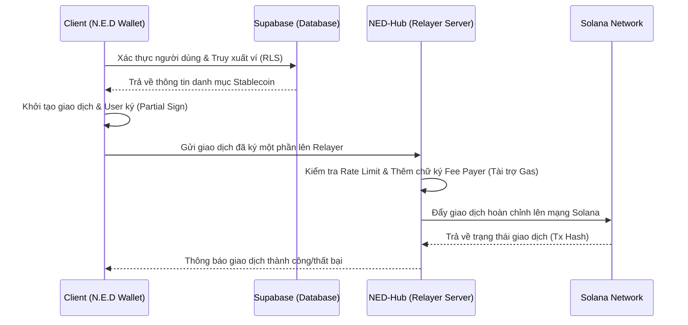

# N.E.D Wallet 🚀

## 1. Giới thiệu dự án (Project Overview)

**Tên dự án:** N.E.D Wallet

**Mô tả:** N.E.D Wallet là một ví Web3 thông minh trên nền tảng Solana, được thiết kế tập trung vào trải nghiệm người dùng liền mạch (chuẩn Web2.5). Ứng dụng mang phong cách thiết kế **Neo-brutalism** phá cách, độc đáo và cung cấp giải pháp quản lý linh hoạt, an toàn cho các tài sản Stablecoin của bạn.

---

## 2. Hình ảnh minh họa (Screenshots & Assets)

*(Lưu ý: Thay thế `YOUR_IMAGE_ID` trong các link dưới đây bằng ID thực tế của từng ảnh trên Google Drive để GitHub render trực tiếp)*

| Home | Analytics | QR Scan | Auth |
| :---: | :---: | :---: | :---: |
|  |  |  |  |

> 🎨 **Toàn bộ tài nguyên thiết kế:** [Xem trên Google Drive](https://drive.google.com/drive/folders/1e1gSUG-g5Ha5jdqUT4mdwWAhQoJOlz68?usp=drive_link)

---

## 3. Tính năng nổi bật (Key Features)

* 🎨 **Giao diện Neo-brutalism:** Hệ thống UI/UX độc đáo với viền đen dày, bóng đổ cứng (hard shadows) và tích hợp các hiệu ứng phản hồi haptic sinh động mang lại cảm giác chân thực.
* ⚡ **Gasless Transactions:** Trải nghiệm Web2.5 hoàn hảo. Ví tài trợ phí mạng lưới (network fee) thông qua Relayer (NED-Hub), giúp người dùng thực hiện giao dịch hoàn toàn miễn phí mà không cần giữ SOL làm phí gas.
* 🌍 **Đa ngôn ngữ (i18n):** Hỗ trợ chuyển đổi toàn diện và mượt mà giữa Tiếng Việt và Tiếng Anh trên toàn bộ ứng dụng.
* 🔒 **Bảo mật & Quản lý:** Tách biệt dữ liệu thẻ Stablecoin của từng tài khoản một cách an toàn thông qua chính sách bảo mật Row Level Security (RLS) của Supabase.

---

## 4. Kiến trúc hệ thống (Architecture)

N.E.D Wallet hoạt động dựa trên cơ chế ký giao dịch một phần (partial sign) kết hợp với Relayer Server để đài thọ phí giao dịch cho người dùng.

---

## 5. Công cụ & Công nghệ (Tech Stack)

Dự án được xây dựng với các công nghệ hiện đại và mạnh mẽ nhất:

* **Framework & UI:**

| Công nghệ | Vai trò trong hệ thống |
| :--- | :--- |
|  | Nền tảng cốt lõi phát triển giao diện Cross-platform |
|  | Quản lý vòng đời ứng dụng, cấp quyền thiết bị & build hệ thống |
|  | Xử lý hiệu ứng mượt mà (60fps) mang phong cách Neo-brutalism |

* **Blockchain (Solana):**

| Công nghệ | Vai trò trong hệ thống |
| :--- | :--- |
|  | Tương tác trực tiếp với RPC và đọc/ghi dữ liệu lên mạng Solana |
|  | SDK chuẩn hóa tương tác với các Smart Contracts (Programs) |

* **Backend-as-a-Service & Auth:**

| Công nghệ | Vai trò trong hệ thống |
| :--- | :--- |
|  | Lưu trữ Database (PostgreSQL) & phân quyền Row Level Security (RLS) |
|  | Giải pháp xác thực an toàn, khởi tạo ví Web3 nhúng (Embedded Wallet) |

* **State Management & Utils:**

| Công nghệ | Vai trò trong hệ thống |
| :--- | :--- |
|  | Quản lý State tập trung, phân tách logic on-chain & UI tinh gọn |
|  | Khung chuyển đổi đa ngôn ngữ (Localization - Tiếng Việt/Anh) |
