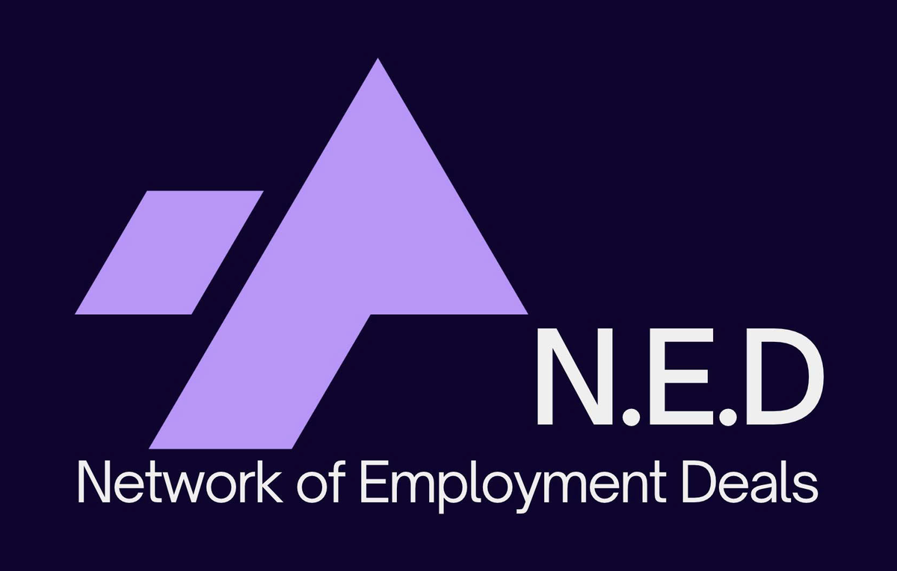
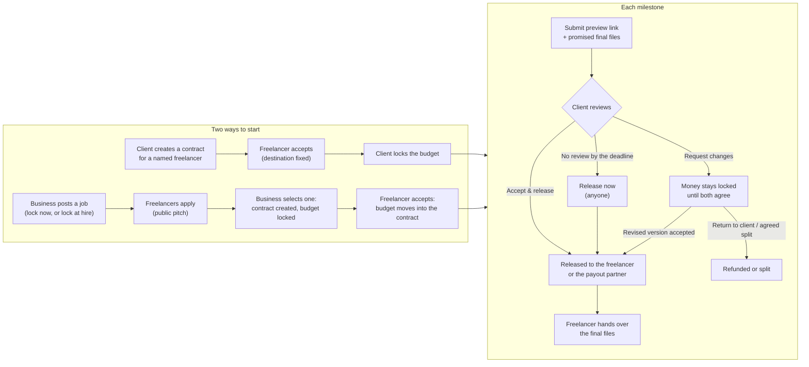
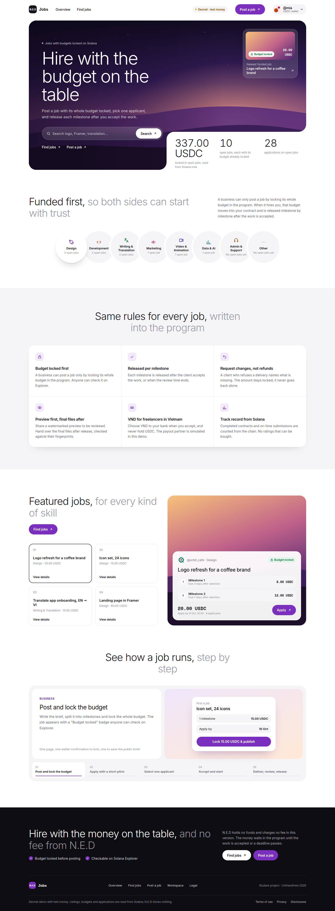
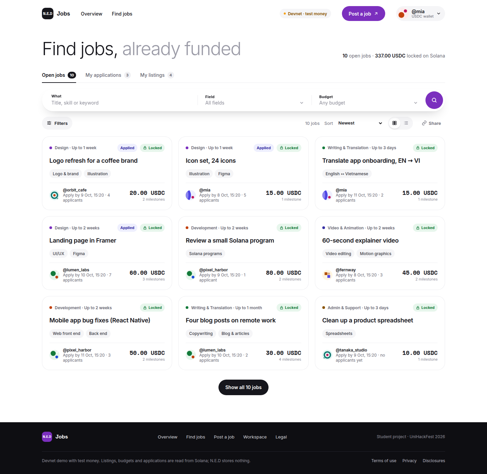
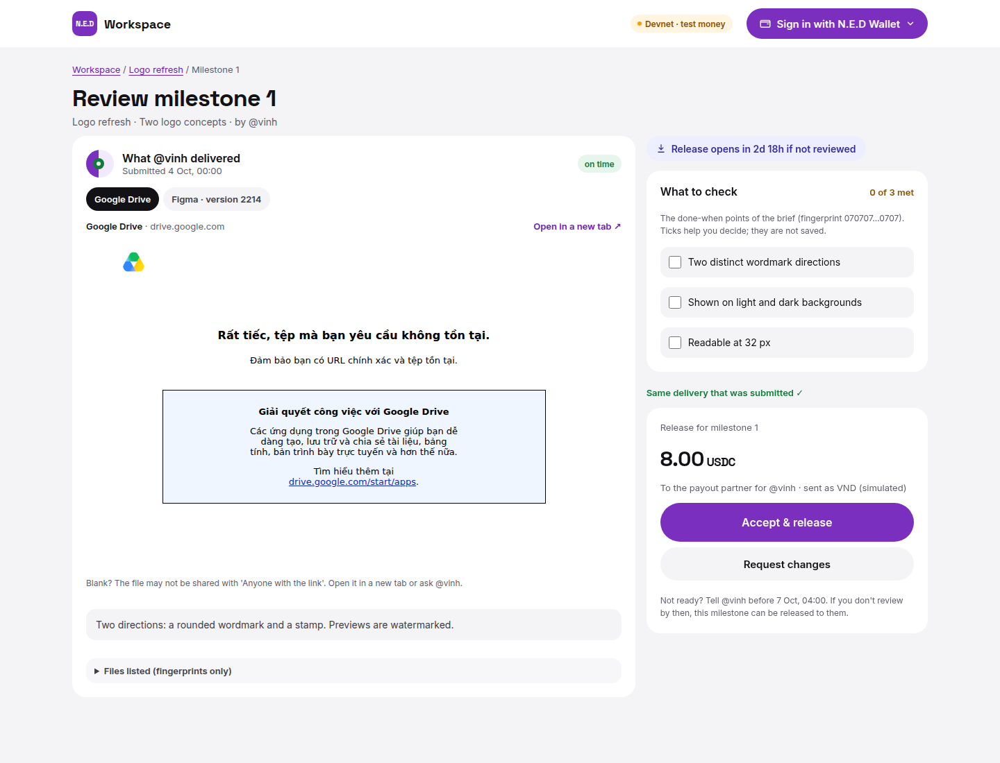
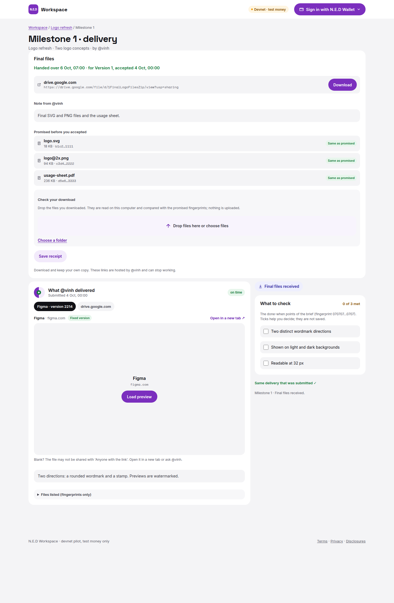
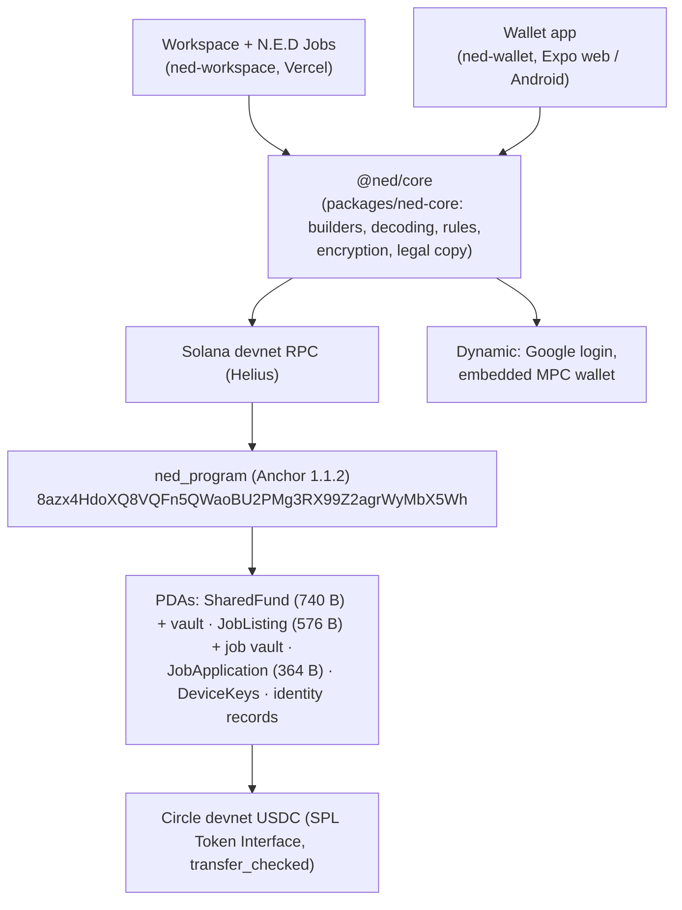

<div align="center">



# N.E.D: Network of Employment Deals

**The budget is locked by code before the work starts. Each milestone is released by rules written at creation.<br/>Freelancers in Vietnam receive VND through a payout partner and never hold USDC.**

[](https://explorer.solana.com/address/8azx4HdoXQ8VQFn5QWaoBU2PMg3RX99Z2agrWyMbX5Wh?cluster=devnet)
[](https://www.anchor-lang.com/)
[](https://www.typescriptlang.org/)
[](https://www.dynamic.xyz/)
[](#team-and-competition)

[Workspace](https://unihackfest-2026.vercel.app) · [N.E.D Jobs](https://unihackfest-2026.vercel.app/jobs) · [Wallet app](https://tdat10052499.github.io/Unihackfest-2026/) · [Program on Explorer](https://explorer.solana.com/address/8azx4HdoXQ8VQFn5QWaoBU2PMg3RX99Z2agrWyMbX5Wh?cluster=devnet) · [Decision log](docs/09-milestone-lock/README.md)

</div>

> **Student prototype on Solana devnet.** Test tokens only, not audited, payout partner simulated (candidates: Due, Nium). N.E.D holds no funds, converts nothing and charges no fee in this version. Nothing here is legal, tax or financial advice. See [Limits and disclosures](#limits-and-disclosures).

---

## Contents

- [What N.E.D does](#what-ned-does)
- [How it works](#how-it-works)
- [Rules the program enforces](#rules-the-program-enforces)
- [The apps](#the-apps)
- [Architecture](#architecture)
- [Status](#status-7-oct-2026)
- [Build and test](#build-and-test)
- [Run the apps](#run-the-apps)
- [Deploy (owners only)](#deploy-owners-only)
- [Environment variables](#environment-variables)
- [Repository layout](#repository-layout)
- [Limits and disclosures](#limits-and-disclosures)
- [Documentation](#documentation)
- [Team and competition](#team-and-competition)
- [License](#license)

---

## What N.E.D does

Freelancers who work for clients abroad often finish the work before they know whether the money exists. Clients, in turn, often fund the whole job before they have seen any of the work. N.E.D puts the money in the middle, held by a Solana program rather than by a company:

- **Clients** split a job into milestones, each with its own "done when" points and deadlines. They lock the budget in a vault that belongs to the program, not to N.E.D.
- **Freelancers** see that the budget is locked before they accept. They submit a watermarked preview for each milestone, and their earnings are released when the client accepts the work. If the client does not review in time, anyone can press **Release now**.
- **Freelancers in Vietnam** choose "VND to my bank account" when they accept. The released amount goes to a payout partner's address, fixed on-chain at that moment, and the partner sends VND (simulated in this demo). Their screens show "≈ … VND (estimate)" and no USDC.
- **N.E.D Jobs** is the board where businesses post work and freelancers apply. The budget is locked when the job is posted, or (program v1.4) when the business selects someone. It is always locked before the freelancer can accept.

---

## How it works


```mermaid
flowchart LR
    subgraph Start["Two ways to start"]
        A1["Client creates a contract<br/>for a named freelancer"] --> A2["Freelancer accepts<br/>(destination fixed)"] --> A3["Client locks the budget"]
        B1["Business posts a job<br/>(lock now, or lock at hire)"] --> B2["Freelancers apply<br/>(public pitch)"] --> B3["Business selects one:<br/>contract created, budget locked"] --> B4["Freelancer accepts:<br/>budget moves into the contract"]
    end
    A3 --> M
    B4 --> M
    subgraph M["Each milestone"]
        S["Submit preview link<br/>+ promised final files"] --> R{"Client reviews"}
        R -->|"Accept & release"| REL["Released to the freelancer<br/>or the payout partner"]
        R -->|"Request changes"| CH["Money stays locked<br/>until both agree"]
        R -->|"No review by the deadline"| RN["Release now<br/>(anyone)"] --> REL
        CH -->|"Revised version accepted"| REL
        CH -->|"Return to client / agreed split"| END2["Refunded or split"]
        REL --> H["Freelancer hands over<br/>the final files"]
    end
```

**Contract states:** `Created → Accepted → Funded → Settled → Closed`.

**Milestone states:**
- `Pending → Submitted → Released`;
- `Pending → Refunded` (Refund now after the submission deadline);
- `Submitted → Disputed ("Changes requested") → Released | Refunded | Cancelled`.

While changes are requested, no deadline runs.

**Job states:** `Open → Selected → Filled`, or `Withdrawn`.

The full lifecycle tables, with every scenario and its status, are in [`docs/09-milestone-lock/system-tracker.md`](docs/09-milestone-lock/system-tracker.md).

---

## Rules the program enforces

| Rule | How |
| --- | --- |
| **No instruction lets N.E.D move locked funds** | Each contract and each job has its own vault, a PDA owned by the program. Release and refund go only to addresses fixed on-chain. |
| **Nobody takes the money alone** | Money moves only when:<br/>• the client accepts;<br/>• the review deadline passes (**Release now**, anyone can call it);<br/>• the submission deadline passes (**Refund now**);<br/>• the freelancer returns it;<br/>• both sides agree a split. |
| **Request changes never refunds the client** | A disputed milestone can only be released, returned by the freelancer, or split by agreement. |
| **The destination is fixed at accept** | Set when the freelancer accepts. The Vietnam path only accepts an allow-listed partner address. |
| **The budget is locked before the freelancer accepts** | `select_job` refuses a job whose budget is not in its vault. `accept + lock_from_job` runs in one transaction. |
| **Accounting always adds up** | `released + refunded + unsettled = total` for every contract, checked in tests. Payouts use stored amounts, never vault balances, so token donations change nothing. |
| **Limits** | 1–5 milestones; at most 1,000 USDC per contract; minimum work and review windows; one application per person per job. |

---

## The apps

| App | For | Where |
| --- | --- | --- |
| **Workspace** (`ned-workspace/`, Vite + React) | Contracts on a computer: brief editor, contract page, submit with preview link, review with an embedded preview, final files, records. Includes the **wallet panel**: sign-in, the confirm step of every signature, and Slide to accept / Slide to lock. | [unihackfest-2026.vercel.app](https://unihackfest-2026.vercel.app) |
| **N.E.D Jobs** (inside the Workspace, `/jobs`) | Overview, Find jobs (search by what, field and budget; filters), job detail and apply, post a job, applicants and select. Legal pages (Terms, Privacy, Disclosures, Job posting rules) are linked from the footer. | [/jobs](https://unihackfest-2026.vercel.app/jobs) |
| **Wallet app** (`ned-wallet/`, Expo, web first) | The phone side: Google sign-in with an embedded wallet (no seed phrase), the Vietnam view in ≈ VND, accept and lock, contract screens, records CSV | [GitHub Pages](https://tdat10052499.github.io/Unihackfest-2026/) and `/wallet` inside the Workspace |

<table>
  <tr>
    <td align="center"><br/><sub>N.E.D Jobs · Overview</sub></td>
    <td align="center"><br/><sub>Find jobs · search and filters</sub></td>
  </tr>
  <tr>
    <td align="center"><br/><sub>Review · the preview loads only after a click</sub></td>
    <td align="center"><br/><sub>Final files · download, check, receipt</sub></td>
  </tr>
</table>

---

## Architecture


```mermaid
flowchart TB
    W["Workspace + N.E.D Jobs<br/>(ned-workspace, Vercel)"] --> C
    P["Wallet app<br/>(ned-wallet, Expo web / Android)"] --> C
    C["@ned/core<br/>(packages/ned-core: builders, decoding, rules,<br/>encryption, legal copy)"] --> RPC["Solana devnet RPC (Helius)"]
    C --> D["Dynamic: Google login,<br/>embedded MPC wallet"]
    RPC --> PR["ned_program (Anchor 1.1.2)<br/>8azx4HdoXQ8VQFn5QWaoBU2PMg3RX99Z2agrWyMbX5Wh"]
    PR --> PDA["PDAs: SharedFund (740 B) + vault · JobListing (576 B) + job vault ·<br/>JobApplication (364 B) · DeviceKeys · identity records"]
    PDA --> USDC["Circle devnet USDC (SPL Token Interface, transfer_checked)"]
```

- **N.E.D runs no database or server of its own.** Shared state lives on Solana and the apps read accounts and transactions directly. Hosting (Vercel, GitHub Pages) serves the app files and keeps its usual logs.
- **Private content on a public chain.** Briefs, deliveries and review notes are encrypted on the device with **XChaCha20-Poly1305** and posted as notes. Each contract key is wrapped for every registered device with **X25519 + HKDF-SHA256**; device public keys are on-chain and private keys never leave the device. N.E.D has no key. Anyone holding a contract's invite link can read its content.
- **Public by design.** Job listings (title, summary, brief, milestones, budget) and applications (pitch, wallet, @username) are plain text on Solana, for good.
- **Files are never uploaded.** Deliveries carry links (Drive, Figma, YouTube, Loom, image links) and SHA-256 fingerprints of files that stay on the freelancer's computer.

---

## Status (7 Oct 2026)

| Part | State |
| --- | --- |
| **Program on devnet** | **v1.3**: Milestone Lock (create, accept, lock, submit, approve, Release now, Refund now, request changes, return, split, close, encrypted notes), device keys, identity, and Funded Jobs (`post_job`, `apply_job`, `select_job`, `lock_from_job`, `withdraw_job`). 27 instructions, 53 errors, 24 events, 54 tests. Not audited. |
| **Program v1.4** (lock at hire, D29) | Built and tested: 29 instructions, 55 errors, 26 events, **67/67 tests**. Adds `post_job_open` and `fund_job`, and the selected-applicant check in `lock_from_job`. Devnet upgrade pending (needs a 14,576-byte program extend). |
| **Workspace and N.E.D Jobs** | Live at the Workspace URL: contracts, review with preview, final files, notifications, consent, hub v4, Legal pages |
| **Wallet app** | Live on GitHub Pages: Vietnam view, accept and lock, contract screens, records. Request changes, revised versions and splits are **Workspace only** for now. |
| **Hidden** | Swap and xStocks: code kept, routes switched off (`ned-wallet/constants/features.ts`) |
| **Tests on `main`** | Program 67 (v1.4) · `@ned/core` 171 · wallet 38 · Workspace 22 (node) + 106 (Vitest). Last full runs: `docs/tong-hop-tien-do.md` (rows V0–V2). |

**Compute units:**
- Measured with LiteSVM on v1.4, 7 Oct 2026, over 10 runs.
- Each range is lowest–highest: test keypairs are random, and every extra PDA bump search costs about 1,500 CU.
- Source: `docs/tong-hop-tien-do.md` and `program-spec.md` §11.5.

| Instruction | CU |
| --- | ---: |
| `create_fund` (3 milestones) | 24,142–33,142 |
| `lock` | 22,482–28,482 |
| `approve` | 22,907–31,938 |
| `release_after_review` | 23,077–32,108 |
| `post_job` (2 milestones) | 34,173–49,173 |
| `post_job_open` (2 milestones) | 26,120–36,620 |
| `fund_job` | 21,154–24,154 |
| `lock_from_job` | 37,545–45,045 |
| `accept_cancel` | 35,515–43,015 |

Every instruction uses less than 25% of the default 200,000 CU budget; the highest measured is `post_job` at 49,173.

**One-step selection fits in a transaction.** `fund_job + create_fund + select_job` with 5 milestones and two compute-budget instructions is 789 bytes, under the 1,232-byte limit.

---

## Build and test

**Prerequisites:**
- Rust 1.89 (pinned in `ned_program/rust-toolchain.toml`);
- Solana CLI 3.x (platform-tools v1.52);
- Anchor CLI **1.1.2** (`avm install 1.1.2 && avm use 1.1.2`);
- Node.js 22+;
- pnpm.

```bash
git clone https://github.com/Tdat10052499/Unihackfest-2026.git
cd Unihackfest-2026

# Program: build, then the LiteSVM tests (they load target/deploy/ned_program.so)
cd ned_program
anchor build
cargo test --manifest-path programs/ned-program/Cargo.toml -- --nocapture
cd ..

# Apps and shared core (pnpm workspace at the repo root)
pnpm install
npm test                                  # @ned/core, wallet and Workspace node tests
cd ned-workspace && npm run test:ui       # Workspace UI tests (Vitest)
```

**What the program tests cover:**
- happy paths, and the Vietnam payout path;
- every settlement deadline at the exact second and the second after;
- attacks (wrong mint, wrong signer, double release, token donations);
- the accounting invariant;
- account byte layouts;
- D27 note rules, Funded Jobs, lock at hire, and the selected-applicant check;
- compute units.

**Check the deployed program without spending anything:**

```bash
cd ned-wallet
npm run jobs:smoke -- --check     # deployed binary == local build, core IDL == built IDL
```

`npm run jobs:smoke` without `--check` replays the Funded Jobs flow on devnet with throwaway keys (`ned-wallet/.smoke-keys/`, gitignored). It stops and prints the addresses to fund when they need devnet SOL or USDC (Circle faucet). It never moves funds from team wallets.

---

## Run the apps

**Workspace and N.E.D Jobs**

```bash
cd ned-workspace
cp .env.example .env.local        # fill in (see Environment variables)
npm run dev                       # http://localhost:5173
npm run build:all                 # Workspace + the wallet build served at /wallet
```

**Wallet app**

```bash
cd ned-wallet
cp .env.example .env
npm run web                       # http://localhost:8081
```

Both apps sign in through the same Dynamic environment, so the same Google account opens the same wallet. Add your local origin to the Dynamic dashboard's CORS origins.

---

## Deploy (owners only)

**Program** (spends devnet SOL; the upgrade authority is the team's deploy wallet):

1. `solana program show 8azx4HdoXQ8VQFn5QWaoBU2PMg3RX99Z2agrWyMbX5Wh --url devnet`. If the new `.so` is larger than *Data Length*, run `solana program extend <program id> <bytes> --url devnet`.
2. `anchor deploy --provider.cluster devnet --no-idl`.
3. Upload the IDL with `npx @solana-program/program-metadata@0.5.1` (create-buffer → update idl --close-buffer). Copy `target/idl/ned_program.json` and `target/types/ned_program.ts` to `packages/ned-core/src/idl/` and `ned-wallet/idl/`.
4. `npm run jobs:smoke -- --check` must pass.

**Workspace:** Vercel project with Root Directory `ned-workspace`.
- `vercel.json` sets the pnpm install, the build, the SPA rewrite and the security headers. The `Content-Security-Policy` is enforced; frames are allowed only from Dynamic and the five preview hosts.
- `main` deploys to production.
- When the app uses a new runtime host, add it to the CSP.

**Wallet app (GitHub Pages):**
- Run `npm run predeploy && npm run deploy` in `ned-wallet/`.
- The base URL is `/Unihackfest-2026`.
- Never set `EXPO_PUBLIC_DEV_TOOLS` for the public build.

---

## Environment variables

Every `VITE_*` and `EXPO_PUBLIC_*` value is bundled into a public web build. Never put a secret in one, and restrict API keys to the deployed domains. The examples are in `ned-workspace/.env.example` and `ned-wallet/.env.example`.

| Name | Required | Used for |
| --- | --- | --- |
| `VITE_DYNAMIC_ENVIRONMENT_ID` / `EXPO_PUBLIC_DYNAMIC_ENVIRONMENT_ID` | yes | Google login and embedded wallet (same value in both apps) |
| `VITE_HELIUS_DEVNET_URL` / `EXPO_PUBLIC_HELIUS_DEVNET_URL` | recommended | Devnet RPC; empty uses the public RPC, which rate-limits |
| `VITE_PROGRAM_ID` / `EXPO_PUBLIC_ANCHOR_PROGRAM_ID` | no | Override the program ID. Keep empty in production. |
| `VITE_FEATURE_JOBS`, `VITE_FEATURE_DISPUTE` | no | `false` switches N.E.D Jobs or the request-changes group off (`VITE_FEATURE_LOCK_AT_HIRE` comes with v1.4) |
| `VITE_MOBILE_ORIGIN`, `VITE_WORKSPACE_ORIGIN` | no | Origins used in invite links |
| `VITE_DEV_TOOLS` / `EXPO_PUBLIC_DEV_TOOLS` | no | Development previews only. Never in a public build. |

Keypairs (deploy wallet, demo payout partner, smoke-test keys) live outside the repository.

---

## Repository layout

```text
Unihackfest-2026/
├── ned_program/                 # Anchor program (Rust)
│   └── programs/ned-program/
│       ├── src/                 # lib.rs, state/, instructions/{identity, milestone, job}, errors, events
│       └── tests/               # LiteSVM: identity.rs, milestone.rs, jobs.rs, helpers.rs, common/
├── packages/ned-core/           # Shared TypeScript core: builders, decoding, rules, encryption, jobs, legal copy, IDL
├── ned-workspace/               # Workspace + N.E.D Jobs (Vite + React), deployed on Vercel
├── ned-wallet/                  # Wallet app (Expo), deployed on GitHub Pages and at /wallet
├── docs/                        # Decisions, specs, research, legal, design boards (start at docs/09-milestone-lock/)
├── site/                        # Earlier static landing page, kept for reference (not deployed)
└── assets/images/               # Logo and README images
```

---

## Limits and disclosures

- **Network:** devnet only. Test USDC (Circle faucet) and test SOL have no value.
- **Audit:** none. The team's deploy wallet still holds the upgrade authority, so the team could change the program. A multisig or an immutable program is planned before any real money.
- **Payout partner:** simulated by a team-controlled devnet address. Real partners (candidates: Due, Nium) and their KYC are not connected.
- **No neutral arbiter:** if changes are requested and the two sides never agree, the amount stays locked.
- **Final files:** after release, N.E.D cannot make anyone hand them over. Fingerprints show what was promised; they do not enforce delivery.
- **Who can read content:** anyone with a contract's invite link can read its encrypted content. Job listings and applications are public and permanent.
- **Residence:** the Vietnam view is self-declared and is not checked.
- **Fees:** none from N.E.D in v1. Network fees are test SOL on devnet.

---

## Documentation

| Topic | Where |
| --- | --- |
| Product direction and decision log (D1–D29) | [`docs/09-milestone-lock/README.md`](docs/09-milestone-lock/README.md) |
| Program specification (byte layouts, instructions, errors, tests; v1.4 in §11) | [`docs/09-milestone-lock/program-spec.md`](docs/09-milestone-lock/program-spec.md) |
| Product spec and word table | [`docs/09-milestone-lock/product-spec.md`](docs/09-milestone-lock/product-spec.md) |
| How the system must behave, scenarios, build tracker | [`docs/09-milestone-lock/system-tracker.md`](docs/09-milestone-lock/system-tracker.md) |
| Progress log with every test run and devnet record (Vietnamese) | [`docs/tong-hop-tien-do.md`](docs/tong-hop-tien-do.md) |
| Research, market and law | [`docs/08-research/ned-research-and-compliance.md`](docs/08-research/ned-research-and-compliance.md) |
| Compliance reviews | [`docs/05-legal/`](docs/05-legal/) |
| Design boards | [`docs/02-thiet-ke/canvas-v2/`](docs/02-thiet-ke/canvas-v2/README.md) |

**Contributing:**
- Commits go straight to `main` as Conventional Commits; run the tests before each push.
- Product copy follows the word table: lock, release, refund, receive earnings, request changes. USDC is never called a payment.
- Anything users or judges can see is checked by the Compliance Lead.

---

## Team and competition

Built by team **N.E.D** for **UniHackFest 2026** (final round, 10 Oct 2026; Best Product & Business and Best Technical Build tracks). This is a student project, not a company or a licensed service.

---

## License

No license file has been added yet, so all rights are reserved by the team until one is chosen.
