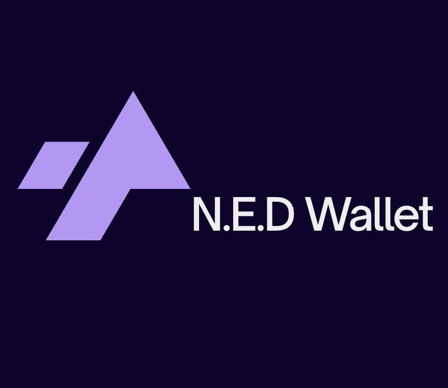
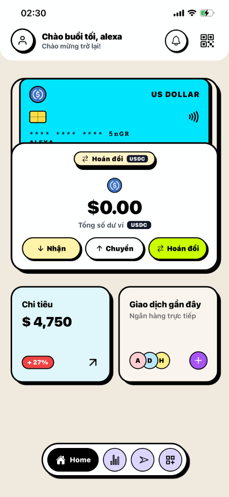
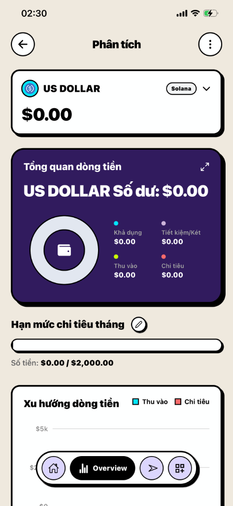
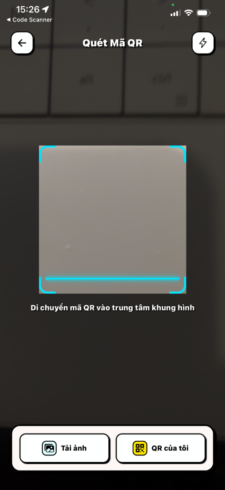
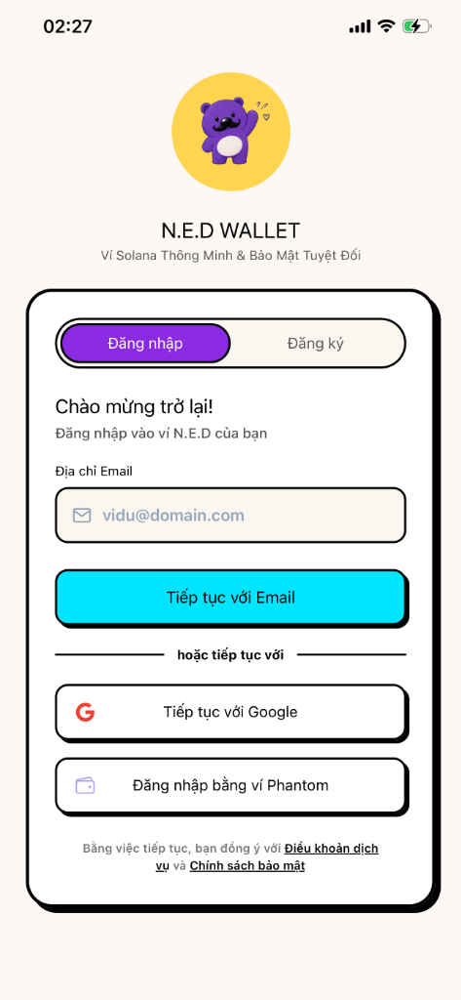
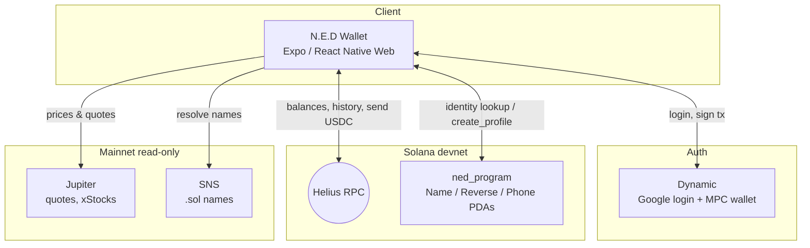
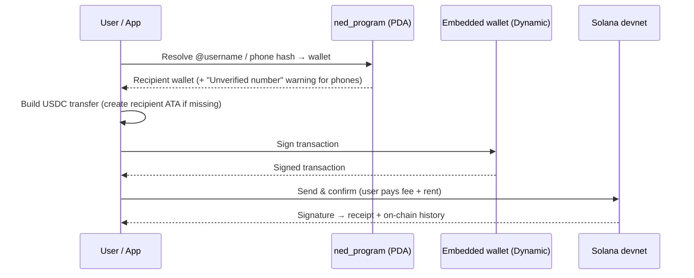

> A Next-Generation Web3 Smart Wallet on Solana Network

> **Team docs (VN):** định hướng dự án, 40 màn hình thiết kế và bàn giao kỹ thuật nằm ở [`docs/`](docs/README.md). Đọc trước khi code.

[](https://solana.com/)
[](https://reactnative.dev/)
[](https://www.typescriptlang.org/)
[](https://jup.ag/)
[](https://www.dynamic.xyz/)

**N.E.D Wallet** is a smart Web3 wallet built on the Solana blockchain, focusing on delivering a seamless Web2.5 user experience. It combines a bold Neo-brutalism design language with stablecoin asset management, P2P USDC transfers and real market data from Jupiter — with **no custom backend**: shared data lives on-chain.

---

## Table of Contents

- [Overview](#overview)
- [UI Showcase](#ui-showcase)
- [Features](#features)
- [Tech Stack](#tech-stack)
- [Architecture & Data Flow](#architecture--data-flow)
- [Project Structure](#project-structure)
- [Setup & Installation](#setup--installation)
- [Guidelines](#guidelines)

---

## Overview

N.E.D Wallet is a decentralized wallet (web first, Android via EAS) where users can:
- Sign in with Google and get an embedded Solana wallet — no seed phrase.
- Send USDC peer-to-peer to a wallet address, an `@username` or a phone number.
- Swap tokens and explore tokenized stocks (xStocks) with real Jupiter prices *(in progress — Demo mode, not broadcast)*.
- Browse Solana dApps in a built-in dApp Browser.
- Switch between Vietnamese and English.

The application integrates:
- **Solana** (devnet for P2P transfers) and the **`ned_program`** Anchor program for on-chain identity.
- **Dynamic** for Google login and embedded MPC wallets *(Phase 1 — currently still Privy)*.
- **Helius** RPC for balances, history and incoming-transfer notifications.
- **Jupiter** (mainnet) for swap quotes and xStocks prices; **SNS** for `.sol` names.

---

## UI Showcase

| Home Dashboard | Analytics View | QR Scan & Transfer | Authentication |
| :---: | :---: | :---: | :---: |
|  |  |  |  |

---

## Features

### Core Capabilities
- **P2P USDC transfers**: send to an address, `@username` or phone number (identity via on-chain PDAs — Phase 1).
- **Neo-brutalism Design**: thick black borders, hard shadows, vibrant colors and haptic feedback.
- **Stablecoin Management**: USDC-first balance cards and sub-wallet cards stored on-device.
- **dApp Browser**: open Solana dApps in a WebView with an injected wallet bridge and a signing prompt.
- **Multi-language Support (i18n)**: Vietnamese and English.

### User Security
- **Embedded wallet, no seed phrase**: Google login + MPC wallet via Dynamic *(migrating from Privy in Phase 1)*.
- **No secrets in the app**: every `EXPO_PUBLIC_*` value is public by design; there is no server holding user data.
- **Phone numbers never go on-chain in clear**: only a scrypt hash is used as the PDA key (Phase 1).

> Network fees: users pay devnet SOL for now. Dynamic SVM Gas Sponsorship requires an Enterprise plan — see [`docs/poc-dynamic.md`](docs/poc-dynamic.md).

---

## Tech Stack

### Frontend & UI
- **React Native 0.86 / Expo SDK 57** (Expo Router, react-native-web) — web first, Android via EAS
- **TypeScript** (strict), **Zustand**, **React Native Reanimated**, **i18next**

### Blockchain & data
- **Solana (@solana/web3.js)** and **Anchor (@coral-xyz/anchor)** — `ned_program` for identity PDAs
- **Helius RPC** — balances, history, notifications
- **Jupiter** — swap quotes and xStocks (mainnet, read-only in Demo mode)
- **SNS (Bonfida)** — `.sol` name resolution

### Auth
- **Dynamic JS SDK** (`@dynamic-labs-sdk/*`) — Google login + embedded Solana MPC wallet *(Phase 1)*
- **Privy** — current login, removed once Dynamic lands (T1.4)

---

## Architecture & Data Flow

No backend: the app talks directly to Dynamic, Solana RPC, the `ned_program` and public APIs. Full folder map and data flow: [`ned-wallet/ARCHITECTURE.md`](ned-wallet/ARCHITECTURE.md).


```mermaid
graph TD
    subgraph Client
        APP[N.E.D Wallet\nExpo / React Native Web]
    end
    subgraph Auth
        DYN[Dynamic\nGoogle login + MPC wallet]
    end
    subgraph Solana devnet
        RPC((Helius RPC))
        PROG[ned_program\nName / Reverse / Phone PDAs]
    end
    subgraph Mainnet read-only
        JUP[Jupiter\nquotes, xStocks]
        SNS[SNS\n.sol names]
    end

    APP <--> |login, sign tx| DYN
    APP <--> |balances, history, send USDC| RPC
    APP <--> |identity lookup / create_profile| PROG
    APP --> |prices & quotes| JUP
    APP --> |resolve names| SNS
```

### P2P transfer flow


```mermaid
sequenceDiagram
    participant U as User / App
    participant P as ned_program (PDA)
    participant W as Embedded wallet (Dynamic)
    participant S as Solana devnet

    U->>P: Resolve @username / phone hash → wallet
    P-->>U: Recipient wallet (+ "Unverified number" warning for phones)
    U->>U: Build USDC transfer (create recipient ATA if missing)
    U->>W: Sign transaction
    W-->>U: Signed transaction
    U->>S: Send & confirm (user pays fee + rent)
    S-->>U: Signature → receipt + on-chain history
```

---

## Project Structure

```text
Unihackfest-2026/
├── docs/                 # Product direction, 40 screen designs, tech handoff, code plan (VN)
├── ned-wallet/           # Expo app — see ned-wallet/ARCHITECTURE.md
│   ├── app/              # Expo Router routes: (auth), (onboarding), (tabs), send, mini-app (dApp Browser)…
│   ├── components/       # Shared UI (neo/*, modals, notifications)
│   ├── contexts/         # MwaProvider, WalletProvider (temporary)
│   ├── hooks/            # Balance, transfer, notification sync, dApp bridge
│   ├── services/         # auth/, identity/, jupiter/, solana.ts, anchorClient.ts, profile.ts…
│   ├── stores/           # Zustand stores
│   ├── idl/              # ned_program IDL
│   └── locales/          # vi.json, en.json
├── ned_program/          # Anchor program (identity PDAs, stablecoin transfer)
└── README.md
```

---

## Setup & Installation

### Prerequisites

- **Node.js** 20+ and **pnpm**
- A **Dynamic** environment ID (and, until Phase 1 lands, a **Privy** app ID)
- For Android: an **EAS** account (development builds run in the cloud; Expo Go is not supported)

### Installation Steps

#### 1. Clone and install

```bash
git clone https://github.com/Tdat10052499/Unihackfest-2026.git
cd Unihackfest-2026/ned-wallet
pnpm install   # postinstall applies scripts/patch-privy.js (removed with Privy in T1.4)
```

#### 2. Configure environment variables

Copy `ned-wallet/.env.example` to `ned-wallet/.env` and fill it in. **Every `EXPO_PUBLIC_*` value ships inside the app bundle — never put a secret there.**

#### 3. Run

```bash
pnpm web                                   # web (http://localhost:8081)
npx expo start --dev-client --tunnel       # Android dev build (see docs/04-ke-hoach-code.md, T0.3)
```

#### 4. Deploy the web build (GitHub Pages)

```bash
pnpm run predeploy && pnpm run deploy
```

---

## Guidelines

### For Developers

#### Code Standards
- **TypeScript**: Strict mode enabled. Define interfaces for all API payloads and state objects.
- **Styling**: Adhere strictly to the **Neo-brutalism** design system defined in `constants/`. Do not use arbitrary colors or border radii.
- **Localization**: Never hardcode English or Vietnamese strings in UI components. Always map via `i18n` using `useTranslation`.
- **State Management**: Keep UI components thin. Delegate complex logic to custom hooks (e.g., `useOnchainTransfer`) or Zustand stores.

#### Git Workflow
1. Create a feature branch: `git checkout -b feature/your-feature`
2. Commit changes using Conventional Commits: `feat: add awesome feature`
3. Push to the branch and open a Pull Request.

---


## License

This project is licensed under the **MIT License**.

---

<div align="center">

**Built with dedication for Unihackfest 2026**

[⬆ Back to Top](#table-of-contents)

</div>
