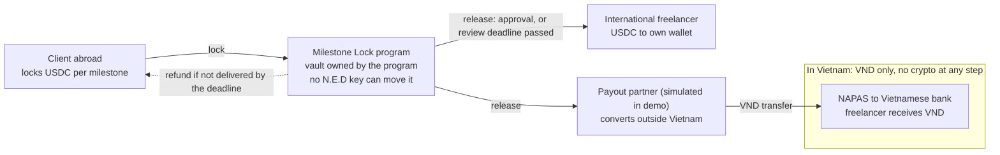

# N.E.D Research & Compliance — Ultimate Edition

Research of 2 Oct 2026 · Author: Nguyễn Minh Chính (Compliance Lead) · UniHackFest 2026 · Not legal or financial advice

> **Build spec:** [`../09-milestone-lock/`](../09-milestone-lock/README.md) (2 Oct 2026) turns this research into the product, program and app specification. Where the two differ on product or program design, `09-milestone-lock` wins; this file stays the source for market, competitor, partner and legal research. Revised 2 Oct 2026 to fix contradictions C1–C11 listed there.

> **Status update, 6 Oct 2026 (Compliance Lead).** The research below is dated 1–2 Oct; these facts have changed since, checked against `main` at `3a1564a` (4 Oct):
> - **The program is built and on devnet.** v1 (2 Oct), v1.1 (3 Oct: `brief_hash`, `post_note`), v1.2 (4 Oct: `DeviceKeys`, key notes). 21 instructions in the whole program, `SharedFund` is 740 bytes, 43 LiteSVM tests. Mobile app and the web Workspace (`unihackfest-2026.vercel.app`) run the full flow.
> - **Contract content is on-chain, encrypted.** The brief and the delivery travel as encrypted `post_note` data; only the two parties' devices hold the key (D15, D22). Contract titles (≤ 32 bytes), hashes and device public keys are public. This replaces "hash only, never the file" in the data plan.
> - **Disputes are built but switched off in the app** (`FEATURES.dispute = false`). In the demo build a client cannot stop release after the review deadline.
> - **Payout design A** (client-side partner account) is the team decision (D9). The partner is a team devnet wallet in the demo: always say "payout partner (candidates: Due, Nium), simulated in the demo", never "licensed partner".
> - **Language (7 Oct, confirmed with the organisers):** the product stays in English ("turn on Vietnamese" in the day plan is dropped); the pitch, slides and Q&A are in **Vietnamese only**. Script: [`../09-milestone-lock/final-pitch.md`](../09-milestone-lock/final-pitch.md).
> - **Upgrade authority** stays with the deploy wallet through 10 Oct so bugs can be fixed on the day; a Squads multisig or an immutable program comes before mainnet (roadmap).
> - The must-fix list for app copy, consent, keys and README is [`../05-legal/compliance-fix-list.md`](../05-legal/compliance-fix-list.md).
>
> Lines changed on 6 Oct are marked "(6 Oct)".

## Bottom line

**Milestone Lock with an offshore payout is the strongest legal and commercial direction N.E.D has had, but on 2 Oct it is a design with zero lines of program code, seven days before code freeze (9 Oct).** (6 Oct: the program shipped on 2–4 Oct; see the status update above.) This edition merges the team's Milestone Lock brief (2 Oct) with the earlier research (customer demographic, competitors, legal brief, evaluation), re-verifies every number and rule at source, and replaces the earlier Rotating Fund demo plan. Labels: **\[Verified\]** opened at source on 1–2 Oct 2026 · **\[Inference\]** our reasoning · **\[Assumption\]** a planning number to test · **\[Unverified\]** not confirmed.

**The five things that decide the result**

1. **Build the Milestone Lock program by 5 Oct and the contract screens by 7 Oct, tested.** About 30–45 hours of work for 1–2 developers, three times v3's 8–12 h budget \[Inference\]. Demo = 2 milestones, lock → submit → approve → release, plus one auto-release after the review deadline.
2. **Say exactly what is legal and what is not.** Crypto is not a lawful payment instrument in Vietnam: Decree 52/2024 Art. 3(11) and Art. 8(6); fines are now **VND 150–200 m for individuals and 300–400 m for organisations** under Decree 340/2025 (in force 9 Feb 2026), which replaced Decree 88/2019 \[Verified\]. The Vietnam freelancer must receive only VND.
3. **Name the open legal risk instead of hiding it.** Whether N.E.D itself provides a "crypto-asset related service" (Decree 284/2026 Art. 7(4), organisations VND 180–200 m) is unresolved \[Unverified\]. Judges will respect "devnet, non-custodial, no fee, lawyer review before launch".
4. **Do not claim to be first.** GigSafe, Stillpaid and Solia already run Solana milestone escrow on devnet \[Verified\]. N.E.D's honest edge: the Vietnam corridor with VND through a payout partner (candidates: Due, Nium; simulated in the demo) (6 Oct), auto-release, and a planned client fee of 1% (none charged in v1) against Upwork's 5% + 0–15% and Fiverr's 5.5% + 20% \[Verified\].
5. **Bring evidence on stage.** No official count of Vietnamese freelancers exists (ILO, 2024) \[Verified\]; the team's survey by 6 Oct is the only first-party data judges will see.

**Corrections to earlier documents (details in the last sections):** fines for unlawful payment instruments were VND 50–100 m under Decree 88/2019 in our earlier docs; Decree 340/2025 replaced it. The "17 million holders" figure is from VnEconomy (27 Jan 2026) and baochinhphu (5 Mar 2025), not a January 2026 government portal article.

## N.E.D in WH-questions

**One sentence: N.E.D lets a foreign client lock USDC per milestone in a Solana program before work starts, so a Vietnamese freelancer knows the money exists and receives it in VND through a payout partner when the work is approved.** (6 Oct: "licensed" removed; the partner is simulated in the demo.)

| Question | Answer | Evidence |
| --- | --- | --- |
| **Who** is it for? | Vietnamese freelancers and remote workers (about 22–35, Hanoi and Ho Chi Minh City; design, content, translation, development, ads) working directly for foreign clients; and those clients (startups, agencies, Web3 teams) | [Thanh Niên, 3 Oct 2025](https://thanhnien.vn/ngay-cang-co-nhieu-nguoi-lam-viec-tu-do-tren-nen-tang-so-185251003140934982.htm): 500,000+ in Facebook freelancer groups, profiles aged 25–31 \[Verified, case stories\] |
| **Who** pays N.E.D? | Planned: the client, 1% of the locked amount at release (2% as a sensitivity case). Nothing is charged in v1, and there is no fee code (decision D2) | \[Assumption\] |
| **What** is it? | Milestone Lock: per-milestone USDC lock, submit, approve, auto-release or refund by deadline, payout to a fixed destination | Team brief, 2 Oct 2026 |
| **What** is it not? | Not a wallet that lets Vietnam users hold or trade crypto; not a payment service; not custody; not a marketplace | Section "Legal and compliance" |
| **Why** does it matter? | 68% of Vietnamese freelancers had not been paid at least once (highest of 4 SEA markets); 85% of contractors globally are paid late at least sometimes | [PayPal survey via The Leader, 2017](https://e.theleader.vn/68-per-cent-of-freelancers-in-vietnam-having-experiences-of-not-being-paid-d2518.html) \[Verified, dated\]; [Remote, Feb 2025](https://remote.com/blog/contractor-management/reversing-late-payment-culture) \[Verified\] |
| **Why** not Upwork or Fiverr? | Off-platform work has no protection; platforms cost the freelancer 0–15% (Upwork) or 20% (Fiverr) plus client fees, and hold money for 14–19 days | [Upwork](https://support.upwork.com/hc/en-us/articles/211063718), [Fiverr](https://help.fiverr.com/hc/en-us/articles/360010639617) \[Verified\] |
| **Why** now? | Deel pays 10,000+ contractors in stablecoins via Solana (May 2026); Payoneer announced stablecoins via Bridge (Feb 2026); Nium launched USDC funding on Solana (27 Aug 2026) | [Deel](https://finance.yahoo.com/markets/crypto/articles/deel-launches-stablecoin-salary-payouts-000158253.html), [Payoneer](https://www.payoneer.com/press/payoneer-to-launch-stablecoin-capabilities-powered-by-bridge-bringing-secure-always-on-digital-money-to-global-businesses/), [Nium](https://www.nium.com/newsroom/nium-usdc-funding-global-payouts) \[Verified\] |
| **Why** Solana? | About US$7.2 bn of USDC on Solana (9.7% of all USDC, read 2 Oct 2026); sub-cent fees; Circle's devnet USDC and faucet make the demo real | [DefiLlama](https://defillama.com/stablecoins/Solana) \[Verified, live\] |
| **Where** does money move? | Client's USDC: outside Vietnam. Conversion: payout partner outside Vietnam (candidates: Due, Nium; simulated in the demo) (6 Oct). VND: partner → NAPAS → Vietnamese bank. International freelancers: USDC to their wallet | [Nium VND guide](https://docs.nium.com/docs/payouts/country-and-regional-guides/vnd-payments-to-vietnam) \[Verified\] |
| **Where** first? | Vietnam corridor (VND payout) plus international freelancers, including Vietnamese abroad | Team brief |
| **When**? | Segment and rules decided 6 Oct; code freeze 9 Oct; final 10 Oct; partner sandbox and lawyer review after the competition | Day plan section |
| **How** does it work? | Five steps: create → confirm and choose destination → lock → submit → approve or auto-release; refund if not delivered | Product definition section |
| **How** is it legal? | The Vietnam user only receives VND by bank transfer, a lawful instrument; the crypto leg sits with the foreign client and the payout partner abroad (6 Oct); N.E.D never holds or converts funds. Open point: whether N.E.D is a "crypto-asset related service" | Legal section \[Inference + Unverified\] |
| **How much**? | Client: planned 1% \[Assumption\], not charged in v1, + Solana fees + partner fee (not public). Freelancer: 0% to N.E.D. Compare Upwork client 5% + freelancer 0–15%; Fiverr buyer 5.5% + seller 20%; Escrow.com 2.6% with US$50 minimum | Business model section \[Verified for competitors\] |

## Product definition: Milestone Lock

**A foreign client locks USDC per work milestone in a Solana program; when a milestone is approved, the program releases it to a destination the freelancer fixed in `accept`, before the client locks: the freelancer's own wallet abroad, or an allowlisted payout partner that would pay the Vietnam-based freelancer in VND by bank transfer (candidates: Due, Nium; simulated in the demo) (6 Oct).** The freelancer in Vietnam never holds, receives or sells crypto. Source: team artifact "N.E.D Milestone Lock" (2 Oct 2026), refined here.

The freelancer fixes the destination in `accept`, before the client locks; release goes either to the international freelancer's wallet or to the allowlisted payout partner (with a recipient reference), which pays VND inside Vietnam.

**Parties and what each may do**

| Party | Role | Touches crypto? |
| --- | --- | --- |
| Client (company or individual outside Vietnam) | Creates the contract, locks USDC, approves or disputes milestones; would pay N.E.D's planned fee once fees start | Yes, USDC on Solana, under the client's own law |
| International freelancer (outside Vietnam, including Vietnamese abroad) | Submits milestones, receives USDC in a N.E.D wallet | Yes, only where stablecoins are lawful for them |
| Freelancer in Vietnam | Accepts, submits milestones, receives VND in a Vietnamese bank account | **No USDC at any step.** Signs `accept` and `submit` with the embedded login key; demo fees use devnet test SOL, and a fee payer covers them before launch |
| Payout partner (candidates: Due, Nium; simulated in the demo by a team devnet wallet) (6 Oct) | Receives USDC from the program at its own address, converts outside Vietnam, sends VND via NAPAS | Yes, under its own licences abroad (to be confirmed with each candidate) |
| N.E.D | App, program, interface; plans a software fee (none in v1) | **Holds no funds, converts nothing, sends no money itself** |

**The flow (5 steps)**

1. **Create:** the client enters the freelancer's @username, the job title, milestones, USDC per milestone, a submission deadline and a review deadline per milestone (freelancer-created proposals: roadmap).
2. **Accept and choose where earnings go:** the freelancer accepts (instruction `accept`). The freelancer picks a N.E.D wallet (international) or a Vietnamese bank account through the partner (Vietnam; the partner does KYC). The app fills in the freelancer's own wallet or the allowlisted partner address (the freelancer never types one); the destination is written on-chain in `accept` and can never change.
3. **Lock:** the client moves USDC into a vault owned by the program. The freelancer sees the amount locked before starting work.
4. **Submit:** the freelancer marks the milestone delivered; the time is recorded on-chain with a SHA-256 hash of the delivery (6 Oct: since v1.1 the delivery itself also travels on-chain as an encrypted note that only the two parties can open, D15).
5. **Approve and release:** the client approves; the program transfers that milestone's USDC to the fixed destination. For Vietnam, the partner converts and sends VND.

**Deadline and dispute rules**

| Situation | Rule | Status |
| --- | --- | --- |
| Freelancer misses the submission deadline | Anyone can call `refund`; that milestone returns to the client | Fixed |
| Client does not review before the review deadline | Anyone can call `release_after_review`; that milestone goes to the freelancer's destination, unless the client opened a dispute before the deadline | Decided (D1, 2 Oct) |
| Client opens a dispute | Auto-release stops; settles by client approval, freelancer `concede` (refund) or an agreed split; no neutral arbiter in v1 | P1 group: in the program, **switched off in the app** (`FEATURES.dispute = false`) (6 Oct) |
| Client cancels before submission | Refund only with the freelancer's agreement (agreed-split pair) | P1 group |

**What the Vietnam user sees:** amounts as "≈ … VND (estimate)" next to USD; after release, "Released to payout partner · VND transfer simulated in this demo" (6 Oct: wording per fix C4; no faked processing steps); a monthly record of VND received. No USDC balance, no swap, no xStocks.

**Wording rules (app, deck, booth):** the only word table is `../09-milestone-lock/product-spec.md` section 6 ("escrow" is banned in every UI, not only Vietnamese screens). The artifact's pitch line "freelancers get paid safely" broke this rule; it now reads "freelancers receive their earnings, locked by code" (fixed 2 Oct).

## Core system

**The core is one new account type and twelve instructions (eight never cut) in the existing `ned_program` (6 Oct: as built, 13 Milestone Lock instructions after v1.1 added `post_note`, plus 3 device-key instructions in v1.2; 21 in the whole program), plus the contract screens; the exact byte layout, instructions and tests are in `../09-milestone-lock/program-spec.md`; everything else in the repo is either already working (login, @username, devnet USDC send) or should be hidden.** Repo checked at `main` 45bb5b1 (2 Oct 2026): Anchor 1.1.2, Rust 1.89, program ID `8azx4HdoXQ8VQFn5QWaoBU2PMg3RX99Z2agrWyMbX5Wh`, 10 LiteSVM tests on identity only; last program change 27 Sep \[Verified in repo\]. Re-checked at `main` 3a1564a (4 Oct): program v1.2 on devnet, 43 LiteSVM tests (identity, Milestone Lock groups 1–20, helpers) \[Verified in repo; tests not re-run by CL\] (6 Oct).

**Account: `SharedFund` (kind = Milestone)**, seeds `[b"fund", creator, fund_id]`, 740 bytes since v1.1 added `brief_hash` (was 708) (6 Oct) (layout in the program spec). For Milestone, store client, freelancer and payout destination in the fund and skip `Participant` (keep it for Rotating Fund and Group Goal).

| Field | Purpose |
| --- | --- |
| `kind`, `state` | Milestone; Created / Accepted / Funded / Settled (Cancelled is a milestone status) |
| `creator`, `fund_id` | PDA seeds |
| `client`, `freelancer` | Both fixed at creation; client ≠ freelancer; `freelancer` is the wallet that signs `accept` and `submit` |
| `payout_destination`, `payout_kind` | Set by the freelancer in `accept`, before `lock`, and never changed: own wallet, or payout-partner address |
| `rent_payer` | Pays and gets back the rent (separate from the client so a fee payer can be added later) |
| `mint` | Must equal pinned USDC mint (devnet `4zMMC9srt5Ri5X14GAgXhaHii3GnPAEERYPJgZJDncDU`, [Circle](https://developers.circle.com/stablecoins/usdc-contract-addresses) \[Verified\]) |
| `total`, `released`, `refunded` | Internal accounting; invariant released + refunded + unsettled = total |
| `milestones[5]` | amount, submit\_by, review\_by, submitted\_at, evidence hash (32 bytes), status |
| milestone status `Disputed`; `cancel_proposer`, `cancel_freelancer_amount` | Stops auto-release; two-step agreed split |
| `bump`, `vault_bump`, `_reserved` | Stored bumps; 64 bytes for later fields |

Vault = token account PDA `[b"vault", fund]` owned by the fund PDA. Payout destination = the associated token account of `fund.payout_destination`: the freelancer's own wallet (wallet path) or the allowlisted payout-partner address with a 32-byte recipient reference (Vietnam path), enforced by constraint on every release, so nobody can redirect funds. (Corrected 2 Oct: an earlier version stored the partner address in `freelancer`, which would have stopped the Vietnam freelancer from signing `submit`.)

**Instructions and who may call them** (summary; the authoritative list with accounts and pre-conditions is `../09-milestone-lock/program-spec.md` section 4)

| Instruction | Signer | Rule |
| --- | --- | --- |
| `create_fund` | client (+ rent payer) | 1–5 milestones, amount > 0, now + work window ≤ submit\_by < review\_by, minimum review window (60 s demo, 72 h launch \[Assumption\]) |
| `accept` | freelancer | Sets payout kind and destination; only once, before `lock` |
| `lock` | client | After `accept`; moves exactly `total` USDC into the vault with `transfer_checked` |
| `submit(i, evidence)` | freelancer | Before submit\_by; records time and evidence hash |
| `approve(i)` | client | Releases milestone i to the fixed destination |
| `release_after_review(i)` | anyone | Submitted, review\_by passed, not disputed |
| `refund(i)` | anyone | Not submitted and submit\_by passed; goes to client |
| `dispute(i)` | client | Submitted and before review\_by; blocks auto-release |
| `concede(i)` | freelancer | Disputed; refunds that milestone to the client, so a dispute can always settle |
| `propose_cancel` / `accept_cancel` | both parties | Ends unfinished milestones; agreed split; `accept_cancel` must repeat the expected amounts |
| `close` | creator | All milestones settled or never funded; leftover to client, vault closed, rent to the rent payer |
| `post_note` (v1.1) (6 Oct) | client or freelancer | Encrypted brief, delivery or key note in transaction data; nothing stored in an account |
| `init_device_keys` / `add_device_key` / `remove_device_key` (v1.2) (6 Oct) | the wallet | Registers each device's public key so contracts open on the user's other devices (D22) |

**Security checklist (each from a source opened 2 Oct 2026)**

- [ ] `transfer_checked` with `InterfaceAccount<Mint/TokenAccount>` and `Interface<TokenInterface>` ([Anchor account types](https://www.anchor-lang.com/docs/references/account-types), [Neodyme pitfalls](https://neodyme.io/en/blog/solana_common_pitfalls/))
- [ ] Mint pinned with `address = USDC_MINT`; `has_one` on client, freelancer, creator; vault checked by seeds and stored `vault_bump` (per-instruction accounts in the program spec 4.1); `Signer` on every role
- [ ] Seeds with stored bump; no `init_if_needed` ([Solana program security course](https://solana.com/developers/courses/program-security))
- [ ] Pay from stored amounts, never `vault.amount` (anyone can donate tokens to a vault)
- [ ] State change before every CPI; `checked_add`/`checked_sub` on top of `overflow-checks = true`
- [ ] Time from `Clock::get()?.unix_timestamp`; one boundary convention (`>` after deadline); app countdowns from chain time ([Anza timestamp design](https://docs.anza.xyz/implemented-proposals/bank-timestamp-correction))
- [ ] `emit!` an event for every state change ([Anchor events](https://www.anchor-lang.com/docs/features/events))
- [ ] Close the vault with `close_account` CPI after it is empty
- [ ] No admin, upgrade or arbiter key can move funds; upgrade authority stays with the deploy wallet through 10 Oct so bugs can be fixed on the day; before mainnet, move it to a Squads multisig ([Squads v4](https://github.com/Squads-Protocol/v4)) or make the program immutable (roadmap)
- [ ] Disclose that Circle can freeze USDC addresses, including a vault ([USDC terms](https://www.circle.com/legal/usdc-terms)); one vault per contract limits the damage

**Tests (LiteSVM, clock moved with `set_sysvar`, [Anchor LiteSVM docs](https://www.anchor-lang.com/docs/testing/litesvm))**: every failing constraint; deadlines at t−1, t, t+1; double release; wrong mint, wrong vault, attacker destination; dispute blocks auto-release; full 3-milestone cycle with approve, auto-release and refund ending in released + refunded = total; compute units logged.

**Keep, fix, hide**

| Action | Item | Where | Priority |
| --- | --- | --- | --- |
| Build | Milestone Lock program + tests | `ned_program/programs/ned-program/src/`, `tests/` | P0, by 5 Oct |
| Build | Contract list, create, accept (choose destination), detail (locked / submitted / released), submit, approve; Vietnam view in ≈ VND | `ned-wallet/app/contracts/` | P0, 6–7 Oct |
| Build | Demo funding: Mia's wallet funded from the Circle faucet (20 USDC per 2 h per address; 30 USDC needed on the day) and `recycle-demo-usdc` (partner wallet → Mia). Contract B is prepared in the app, not by a script | `ned-wallet/scripts/` | P0, start now |
| Fix | `getUsdcTokenBalance` adds every token when the USDC account is empty; read only the USDC account, integer amounts | `services/solana.ts` 215–293 | P0 |
| Fix | Mainnet USDC address typo (43 characters, missing a `q`) and four duplicated USDC constants | `services/jupiter/core.ts:1` and three other files | P0 |
| Fix | Phone hash: scrypt with a public salt over about 5×10^8 numbers can be brute-forced; it is still personal data on-chain | `services/identity/phoneKey.ts`, `link_phone` | Say it honestly now; roadmap: OTP + keyed hash off-chain |
| Keep | Google login + MPC wallet, @username, devnet USDC send, history, 10 identity tests | — | — |
| Hide | Swap, xStocks, dApp browser, Earn, orphan screens, fake MWA signing | deck, demo path, `app/(tabs)/` | P1 |
| Roadmap | Blink "Lock this milestone" link (6–10 h), Solana Attestation Service "KYC verified" flag, Rotating Fund, Group Goal | — | After 10 Oct |

## Target customer and demographics

**Two users must both say yes: the Vietnamese freelancer who carries the risk, and the foreign client who locks and pays the fee.** No official count of Vietnamese freelancers or of those with foreign clients exists ([ILO, 20 Sep 2024](https://www.ilo.org/resource/article/pilot-survey-viet-nam-promising-start-defining-digital-platform-employment) \[Verified\]), so the profile below combines case studies with the team survey due 6 Oct.

**Core user: Vietnamese freelancer with foreign clients**

| Factor | Profile | Label |
| --- | --- | --- |
| Age | Mostly 22–35; press profiles 25–31 | \[Inference\] from [Thanh Niên, Oct 2025](https://thanhnien.vn/ngay-cang-co-nhieu-nguoi-lam-viec-tu-do-tren-nen-tang-so-185251003140934982.htm) |
| Location | Ho Chi Minh City, Hanoi; 55% of developers are in HCMC | [TopDev via VnEconomy, Sep 2024](https://vneconomy.vn/muc-luong-trung-binh-hang-thang-cua-cac-ky-su-it-tai-viet-nam-hien-nay.htm) \[Verified\] |
| Work | Design, content, translation, development, ads, Web3 community roles | \[Verified, case stories\] |
| Income | 20–40 m VND/month in press profiles; developers US$1,100–3,000/month | \[Verified, single cases and TopDev\] |
| Finds work | 58% via social media (2017) | \[PayPal survey, dated\] |
| Crypto familiarity | About 17 m Vietnamese hold crypto; VnEconomy reports over 85% of Vietnamese freelancers own crypto (primary survey not identified) | [VnEconomy, 27 Jan 2026](https://vneconomy.vn/viet-nam-la-quoc-gia-thu-46-hop-phap-hoa-tai-san-ma-hoa.htm) \[Verified press; primary Unverified\] |
| Gender split | No reliable survey found | \[Unverified\] |
| Tax | Business income: no PIT up to VND 500 m revenue a year; above that 2% of revenue over 500 m for services, or 15% of profit; quarterly self-filing when the payer is abroad | [Law 109/2025 Art. 7, LuatVietnam](https://luatvietnam.vn/thue-phi-le-phi/diem-moi-cua-luat-thue-thu-nhap-ca-nhan-sua-doi-2025-565-105902-article.html) \[Verified\]; business vs salary treatment \[Unverified\] |

**Pains, ranked by evidence**

1. Not being paid: 68% of Vietnamese freelancers (PayPal, 2017, n = 1,602 across 4 markets) \[Verified, dated\].
2. Cost of receiving: PayPal Vietnam 4.4% + US$0.30 plus a 3–4% conversion spread, about 7.4% on US$1,000 ([PayPal VN fees, May 2026](https://www.paypal.com/vn/webapps/mpp/merchant-fees)) \[Verified; total is our calculation\].
3. Platform cut: Upwork 0–15%, Fiverr 20% \[Verified\].
4. Proving income for tax, visas and loans \[Inference\].

**Paying user: the foreign client**

| Factor | Profile | Label |
| --- | --- | --- |
| Who | Startups, agencies and Web3 teams hiring Vietnamese freelancers directly | \[Assumption\] |
| Already uses | Deel, Payoneer, Wise, PayPal, crypto transfers | \[Inference\] |
| Why lock | Shows commitment to win good freelancers; refund if work is not delivered; one record per contract | \[Assumption, survey question\] |
| Legal home | Outside Vietnam; locking USDC is governed by the client's own law (US, EU, Singapore, Japan rules in the legal section) | \[Verified for the rules cited\] |

**Personas \[Assumption\]**

- **Vinh, 26, freelance designer in Hanoi.** Two Singapore startups pay him US$800–1,500 a month by PayPal; one client vanished owing US$400. He wants the money locked before he starts and VND in his bank.
- **Mia, 31, founder of a Singapore Web3 startup.** Hires three Vietnamese freelancers a year, already holds USDC on Solana, dislikes Upwork's fees and 14-day review hold.

**Survey and interviews by 6 Oct**: 30+ freelancer answers, 6 interviews, 5 client conversations. Adults only; income in bands; no names or phone numbers; consent line at the top (Decree 356/2025 Art. 6 bans implied consent \[Verified\]).

| Screening question | Why |
| --- | --- |
| Are you 18 or older? | Consent and ethics |
| In the last 6 months, has a client outside Vietnam paid you? | Core segment |
| Do you live in Vietnam now? | Decides VND path vs USDC path |
| Has a client ever not paid you, or paid late? | Pain, threshold below |
| Would your clients lock money per milestone through an app? | Willingness, threshold below |
| How do you receive money today, and what does it cost? | Fee comparison |

**Decision thresholds (from strategy v3 section 14.2, unchanged):** go if ≥ 30% have lost money to a client and ≥ 30% say clients would lock money. Below that, keep Milestone Lock as the technical demo and present the problem with the sourced figures only.

## Market data

**The demand signal is strong (Vietnam earns US$11.5 bn a year from overseas digital-tech revenue and ranks 4th in crypto adoption), but the exact size of N.E.D's niche is unknown and must not be invented on a slide.** Only the \[Verified\] rows may go on slides; quote each with its year.

| Fact | Number | Date | Source | Label |
| --- | --- | --- | --- | --- |
| Overseas revenue of Vietnamese digital-tech firms | US$11.5 bn (target US$100 bn by 2035) | 2024 | [VnEconomy, 15 Jan 2025](https://vneconomy.vn/doanh-thu-tu-nuoc-ngoai-cua-doanh-nghiep-so-viet-nam-se-tien-moc-100-ty-usd-vuot-xuat-khau-nong-nghiep.htm) | Verified |
| Software exports | About US$7 bn | 2024 estimate | [Nhân Dân, 10 Aug 2025](https://nhandan.vn/phan-mem-viet-vuon-cao-trong-chuoi-gia-tri-toan-cau-post899259.html) | Verified |
| ICT workers | About 1.26 m in 73,788 firms | 2024 | [VnEconomy, 21 Jan 2025](https://vneconomy.vn/viet-nam-hien-co-gan-74-000-cong-ty-cong-nghe-voi-tren-1-2-trieu-lao-dong.htm) | Verified |
| Informal employment | 63.1% of 52.4 m employed | 2025 | [NSO, 5 Jan 2026](https://www.nso.gov.vn/tin-tuc-thong-ke/2026/01/thong-cao-bao-chi-ve-tinh-hinh-dan-so-lao-dong-viec-lam-quy-iv-va-nam-2025/) | Verified |
| Knowledge workers in the gig economy | 14% full-time freelance, 26% part-time, 13% job plus freelance (Anphabe) | early 2022 | [SGGP, May 2022](https://www.sggp.org.vn/freelancer-tu-do-va-tu-lo-post637610.html) | Verified, near 3 years old |
| Facebook freelancer groups | 500,000+ members (reach, not head count) | Oct 2025 | [Thanh Niên](https://thanhnien.vn/ngay-cang-co-nhieu-nguoi-lam-viec-tu-do-tren-nen-tang-so-185251003140934982.htm) | Verified |
| Vietnamese freelancers not paid at least once | 68% (SEA average 58%) | 2017 | [The Leader](https://e.theleader.vn/68-per-cent-of-freelancers-in-vietnam-having-experiences-of-not-being-paid-d2518.html) | Verified, dated |
| Contractors paid late at least sometimes (global) | 85% | Feb 2025 | [Remote](https://remote.com/blog/contractor-management/reversing-late-payment-culture) | Verified |
| Crypto adoption rank | Vietnam 4th of 151 | Sep 2025 | [Chainalysis](https://www.chainalysis.com/blog/2025-global-crypto-adoption-index/) | Verified |
| Crypto value received | About US$220 bn (Jul 2024–Jun 2025), +55% | Sep 2025 | [The Investor, citing Chainalysis](https://theinvestor.vn/vietnams-crypto-market-value-tops-220-bln-chainalysis-d17199.html) | Verified |
| Crypto holders | About 17 m (peak 21 m) | Jan 2026 | [VnEconomy](https://vneconomy.vn/viet-nam-la-quoc-gia-thu-46-hop-phap-hoa-tai-san-ma-hoa.htm) | Verified |
| USDC on Solana | US$7.16 bn of US$74.06 bn total (9.7%) | read 2 Oct 2026 | [DefiLlama](https://defillama.com/stablecoin/usd-coin) | Verified, live |
| Stablecoin payroll | Deel: 10,000+ contractors paid in stablecoins, payouts via Solana | May 2026 | [Yahoo Finance](https://finance.yahoo.com/markets/crypto/articles/deel-launches-stablecoin-salary-payouts-000158253.html) | Verified |
| Cost to receive US$1,000 | PayPal VN about 7.4% (our calculation); Wise about 0.9% | May–Oct 2026 | [PayPal VN](https://www.paypal.com/vn/webapps/mpp/merchant-fees), [Wise](https://wise.com/us/compare/?sourceCurrency=USD&targetCurrency=VND&sendAmount=1000) | Verified |
| Real demand for on-chain milestone escrow | Trustless Work (Stellar): 1,285 mainnet escrows, US$258k released | 9 Sep 2026 | [Trustless Work](https://www.trustlesswork.com/) | Verified |
| Vietnamese freelancers with foreign clients | No figure | — | — | Gap |

**What this means for the pitch:** lead with the 68% and the fee gap, call the 500,000 a reach figure, and show the team's own survey as the market proof. The Trustless Work figure keeps the team honest: on-chain escrow demand is real but still small, so the opening is a niche corridor, not a mass market.

## Competitors and positioning

**Nobody we found combines per-milestone on-chain locking, auto-release, and VND payout to a Vietnamese bank for off-platform work; but every single piece exists somewhere, so the pitch must claim the combination, not novelty.** All rows opened 1–2 Oct 2026.

| Competitor | Locked milestones | If client is silent | Fees (2026) | Stablecoins | Vietnam | N.E.D's opening |
| --- | --- | --- | --- | --- | --- | --- |
| [Upwork](https://support.upwork.com/hc/en-us/articles/211063718) | Yes, funded upfront | Auto-release after 14 days in review, then 5-day hold | Freelancer 0–15%; client 5% + US$0.99–14.99 per contract; Direct Contracts 5% | No | Bank withdrawal US$0.99 | Up to 19 days and 5–20% total cost; on-platform only |
| [Fiverr](https://help.fiverr.com/hc/en-us/articles/360010639617) | Per milestone | Auto-complete 3 days, then 14-day clearance | Seller 20%; buyer 5.5% (+US$3.50 under US$200) | No | Via Payoneer/PayPal | 25%+ total |
| [Contra](https://contra.com/pricing) | Yes, funded upfront | No time-based release documented | 0% commission; client US$2–29 per project; crypto payout 2% | Some | — | Strongest low-fee rival; N.E.D adds auto-release and VND |
| [Escrow.com](https://www.escrow.com/fee-calculator) | Milestones + inspection period | Releases at end of inspection | 2.6%, US$50 minimum | No | No VND | US$50 minimum hurts small milestones |
| [Deel](https://help.letsdeel.com/hc/en-gb/articles/23524211726481) | Milestone contract type; prefunding not documented | — | US$49/contractor/month; stablecoin withdrawal 2% + US$1 | USDC on Solana | Supports VN contractors | Built for payroll, heavy for one-off jobs |
| [Payoneer](https://www.payoneer.com/press/payoneer-to-launch-stablecoin-capabilities-powered-by-bridge-bringing-secure-always-on-digital-money-to-global-businesses/) | No (left escrow in 2018) | — | Up to 3% withdrawal | Announced via Bridge, Q2 2026 target | Widely used | A rail, possibly a partner |
| [Wise](https://wise.com/us/legal/acceptable-use-policy) | No; escrow use forbidden | — | About 0.65–0.9% on US$1,000 to VND | No | VND to banks | Cheaper transfer, zero protection |
| [Request Finance](https://www.requestfinance.com/pricing) | No escrow | — | Plans US$50–600/month; bank payout 1% + US$10 | USDC/USDT | VND payout listed | Closest on stablecoin-to-VND; possible partner |
| [LaborX](https://www.laborx.com/) | Smart-contract escrow | Not stated | Freelancer 10% | USDC/USDT, not Solana | — | Higher fee, no Solana |
| Solana projects: [GigSafe](https://gigsafe.pixxmo.com/), [Stillpaid](https://github.com/NWichter/stillpaid), [Solia](https://solia.network/) | Yes, USDC on Solana | Stillpaid: "Silent Yes" auto-release | GigSafe 0.5% | USDC | None pays VND | All devnet; N.E.D's edge is the VN corridor and partner payout |
| [Trustless Work](https://www.trustlesswork.com/) (Stellar) | Milestone escrow infrastructure | — | — | USDC on Stellar | — | Live but small (1,285 escrows) |
| [vLance](https://www.vlance.vn/page/dieu-khoan-su-dung-danh-cho-freelancer), [FreelancerViet](https://freelancerviet.vn/en/how-it-works/client/freelance.html) | FreelancerViet: protected milestone deposits | vLance contests: 72 h | vLance contests 20% | No | Domestic VND only | No foreign clients paying in USD |

**What N.E.D can say (true as of 2 Oct 2026):** "A foreign client locks USDC for each milestone before work starts. Each milestone is released to the freelancer's wallet, or reaches a Vietnamese freelancer as VND through a payout partner (simulated in this demo; candidates Due and Nium). The client will pay a planned 1% once fees start; the freelancer pays N.E.D nothing."

**What N.E.D must not say:** "first Solana escrow" or "first auto-release"; "licensed Vietnamese crypto partner" (Vietnam had issued no crypto licence as of 19 Sep 2026); "cheaper than Wise"; "Deel and Payoneer have no stablecoins"; "zero fees" (client fee, network fee and partner spread remain); any dispute-resolution or enforceability promise; an exact time-to-VND.

## Payout partners

**Three providers document both USDC funding on Solana and domestic VND bank payout: Due, Nium and Ripple Payments; none documents the whole path "contract address → VND bank account" in one place, so the demo must say "candidate partners, simulated".** Stripe pays VND only by SWIFT wire; Circle Payments Network lists no VND payout method; Rise has no Solana and lets the freelancer hold crypto, which breaks N.E.D's rule. All rows opened 2 Oct 2026.

| Provider | USDC on Solana in | VND out | Customer | Licences | Price | Gap for N.E.D |
| --- | --- | --- | --- | --- | --- | --- |
| [Due](https://due.readme.io/docs/supported-payment-methods) | Yes; virtual accounts unique to a customer auto-convert crypto to fiat; sandbox issues test USDC | NAPAS, "instant to T+0" | Individuals to enterprises; Vietnam not on its banned list | FINTRAC MSB, Bank of Canada PSP; MiCA CASP (CNMV Spain) covering crypto exchange only | Not public | USDC → VND route not shown in one example; must confirm with sales |
| [Nium](https://docs.nium.com/docs/payouts/country-and-regional-guides/vnd-payments-to-vietnam) | Yes, since 27 Aug 2026, converted to USD on arrival; Nium does not custody stablecoins | NAPAS 2,000–500 m VND real time; CITAD above; MoMo, ZaloPay | "Eligible corporate clients" (KYB) | MAS MPI, FCA, EMI Lithuania/Malta, 33 US MTLs; no crypto licence listed | Not public | Startup eligibility and deposit-address design unknown |
| [Ripple Payments](https://docs.ripple.com/products/payments-direct-2/introduction/payout-network/asia-pacific) | USDC on Solana listed as a payout asset | NAPAS 50,000–499,999,999 VND per transaction | Banks, fintechs, crypto firms | "85+ licences" (self-reported) | Not public | Built for institutions |
| [Stripe Global Payouts](https://docs.stripe.com/global-payouts) | Stablecoin balance; Vietnam in private preview | SWIFT wire only | US/UK senders with Treasury | Not checked | US$1.50 + 1.00% cross-border (Vietnam) + 1% FX for US senders, 2% for others ([pricing](https://docs.stripe.com/global-payouts/pricing)) | Fallback only |
| [Tazapay](https://developer.tazapay.com/collection-accounts/coverage/stablecoins.md) | USDC on 15 chains incl. Solana; "stablecoin-in, local-fiat-out" | VND claimed in a blog; rails unverified | Platforms, fintechs | MTLs in SG, IN, HK, US (third-party); Circle buying it (announced 8 Sep 2026) | Not public | Worth asking after Circle deal |
| [Rise](https://www.riseworks.io/pricing) | No Solana | VND US$10 + 1.45% | Employers; freelancer holds a Rise account | FinCEN MSB | US$49/contractor/month | Freelancer may hold crypto: not usable for the Vietnam path |

**The partner decides who is legally sending money.** Every partner will run KYB on whoever owns the deposit address. Two designs, to settle with a lawyer and the partner:

| Design | Who holds the partner account | Strength | Risk |
| --- | --- | --- | --- |
| A. Client-side payout | The foreign client; the contract releases to the allowlisted partner address with a recipient reference for this freelancer (or, if the partner requires it, a per-freelancer address), partner pays VND | Freelancer never owns crypto; N.E.D is not a party | Client could cancel the payout instruction after release; needs partner support for matching by reference or per-freelancer addresses |
| B. Freelancer-side account | The freelancer opens a partner account whose USDC auto-converts to VND | Simple; Due supports individuals | Freelancer arguably owns USDC for a moment: the open question in the team brief |

Recommendation: **design A** for the pitch, "payout partner simulated" on screen, and ask Due and Nium in writing whether a deposit can be matched to a recipient by a reference, or whether a per-recipient deposit address under the client's account is needed \[Inference\]. v1 implements the reference (`../09-milestone-lock/program-spec.md`, D9 and D13).

**Domestic options are not usable yet.** Vietnam's five pilot exchanges had no licence by 19 Sep 2026 ([CryptoRank](https://cryptorank.io/news/feed/b7225-nine-months-seven-applicants-zero-licences-vietnams-crypto-waiting-game)); the Da Nang sandbox projects (Basal Pay, TORA, Umi Pay and others) cap accounts at 500 USDT or 5 transactions, require physical presence and have the Vietnamese user convert crypto themselves ([Tuổi Trẻ, Jan 2026](https://news.tuoitre.vn/foreign-visitor-demand-drives-pilot-for-digital-asset-conversions-in-da-nang-103260115000440801.htm)) \[Verified\].

**Outreach:** the PO sent the first written questions to Due and Nium on 2 Oct 2026 (USDC on Solana → VND via NAPAS, who must be the customer, per-recipient or per-payout address, deposits from a program address, purpose codes, sandbox and fees). Next, after 10 Oct: sandbox requests to whichever replies, then Tazapay and Ripple. CL logs every reply in Compliance Hub.

## Legal and compliance

**The redesign removes the clearest violation (a Vietnam resident using crypto as payment), but it does not settle whether N.E.D, built and run from Vietnam, provides a crypto-asset related service; that is the one question a lawyer must answer before any real money moves.** Not legal advice. Every row below was opened at an official text, a legal database or a law firm on 1–2 Oct 2026; check article numbers against the official PDF on vanban.chinhphu.vn before quoting them on stage.

**Vietnam: payments and crypto**

| Rule | What it says | What N.E.D must do | Label |
| --- | --- | --- | --- |
| [Decree 52/2024/NĐ-CP](https://thuvienphapluat.vn/van-ban/Tien-te-Ngan-hang/Nghi-dinh-52-2024-ND-CP-thanh-toan-khong-dung-tien-mat-427855.aspx) (in force 1 Jul 2024) | Art. 3(10)–(11): lawful non-cash instruments are those issued by licensed providers (cheques, payment orders, bank cards, e-wallets); anything else is an unlawful instrument. Art. 8(6) bans "phát hành, cung ứng và sử dụng các phương tiện thanh toán không hợp pháp"; Art. 8(7) bans intermediary payment services without an SBV licence | Vietnam users receive only VND by bank transfer; no USDC balance, swap or send for them; never call USDC a payment | Verified |
| [Decree 340/2025/NĐ-CP](https://thuvienphapluat.vn/van-ban/Tien-te-Ngan-hang/Nghi-dinh-340-2025-ND-CP-quy-dinh-xu-phat-vi-pham-hanh-chinh-trong-linh-vuc-tien-te-va-ngan-hang-632998.aspx) (in force 9 Feb 2026, replaces 88/2019 and 143/2021) | Art. 30(6)(d): VND 150–200 m for issuing, supplying or using unlawful payment instruments; organisations pay double (Art. 5(3)(a)) | Quote these fines, not the old 50–100 m | Verified (legal database) |
| Criminal Code Art. 206 | Banking violations incl. unlawful payment instruments; from VND 50–300 m fine or 6 months–3 years | Mention only as "criminal liability possible" | Verified; 2025 amendments Unverified |
| [Resolution 05/2025/NQ-CP](https://luatvietan.vn/nghi-quyet-05-2025-nq-cp-trien-khai-thi-diem-thi-truong-tai-san-ma-hoa-tai-viet-nam.html) (9 Sep 2025, 5-year pilot) | Art. 3: crypto services = trading market, proprietary trading, custody ("receiving, storing, preserving and transferring crypto assets for customers"), issuance platform. Art. 7: 6 months after the first licence, domestic investors trading outside licensed providers are sanctioned. Art. 4: trading and payment in crypto must be in VND | N.E.D holds no keys and no funds; the program has no admin key over vaults; Vietnam users never trade | Verified |
| Licence status | No crypto provider licensed as of 19 Sep 2026; the 6-month clock has not started | Do not mention any "licensed Vietnamese crypto partner" | Verified ([CryptoRank](https://cryptorank.io/news/feed/b7225-nine-months-seven-applicants-zero-licences-vietnams-crypto-waiting-game)) |
| [Decree 284/2026/NĐ-CP](https://lsvn.vn/cac-muc-xu-phat-vi-pham-hanh-chinh-ve-tai-san-ma-hoa-va-thi-truong-tai-san-ma-hoa-a177706.html) (in force 1 Sep 2026) | Art. 7(4): "cung cấp dịch vụ liên quan đến tài sản mã hóa khi chưa được cấp giấy phép": organisations VND 180–200 m, individuals 90–100 m. Art. 9(1): domestic investors trading outside licensed providers VND 30–50 m | **Main open risk**: a smart-contract lock that releases USDC could be read as custody or a "related service". Mitigation: devnet only, no fee, no incorporation in Vietnam, lawyer opinion before launch | Verified text; application Unverified |
| [Law 71/2025/QH15](https://thuvienphapluat.vn/van-ban/Cong-nghe-thong-tin/Luat-Cong-nghiep-cong-nghe-so-2025-so-71-2025-QH15-621341.aspx) (in force 1 Jan 2026) | Art. 46–47 define digital, virtual and crypto assets (excluding securities and digital fiat); no payment ban | Cite for definitions only | Verified |
| [Law on E-Transactions 20/2023/QH15](https://english.luatvietnam.vn/thuong-mai/law-on-e-transactions-2023-no-20-2023-qh15-259738-d1.html) (in force 1 Jul 2024) | Art. 34: contracts concluded or performed by automated information systems are valid without human checking; "smart contract" is not named | Supports the contract record as an e-contract | Verified |

**Vietnam: foreign exchange and tax**

| Rule | What it says | What N.E.D must do | Label |
| --- | --- | --- | --- |
| [Foreign Exchange Ordinance](https://thuvienphapluat.vn/van-ban/Tien-te-Ngan-hang/Van-ban-hop-nhat-07-VBHN-VPQH-2013-hop-nhat-Phap-lenh-Ngoai-hoi-204381.aspx), Art. 6 | Payments for current transactions between residents and non-residents are free | A foreign client paying a Vietnamese freelancer for services is a current transaction | Verified |
| [Circular 32/2013 (consolidated 28/VBHN-NHNN, 2026)](https://luatvietnam.vn/tai-chinh/van-ban-hop-nhat-28-vbhn-nhnn-2026-huong-dan-han-che-su-dung-ngoai-hoi-tai-viet-nam-431734-d5.html), Art. 4(16)(b) | A resident supplying services to a non-resident may quote prices in foreign currency | Price the contract in USD; show VND as an estimate | Verified; whether it covers individuals Unverified |
| Decree 52 Art. 5 and Circular 40/2024 Art. 31 | Foreign intermediaries must work through a Vietnamese commercial bank | Choose a partner that pays via a licensed Vietnamese bank (Nium and Ripple document NAPAS) | Verified |
| [Law 109/2025/QH15 on PIT](https://english.luatvietnam.vn/law-on-personal-income-tax-no-109-2025-qh15-422733-doc1.html) (in force 1 Jul 2026; 2026 tax year) | Art. 7(1): no PIT for business revenue up to VND 500 m a year; services above that pay 2% of the excess or 15% of profit; quarterly self-filing on form 02/KK-TNCN when the payer is abroad | Income record in VND for the freelancer's own filing; never "tax-compliant" | Verified; business vs salary Unverified |

**Vietnam: data, cyber and AML** (details in the KYC section)

| Rule | Key duty | Label |
| --- | --- | --- |
| [PDP Law 91/2025 + Decree 356/2025](https://rouse.com/insights/news/2026/vietnam-key-developments-in-personal-data-protection-under-decree-no-356-2025-nd-cp-and-issues-businesses-need-to-review) (1 Jan 2026) | Explicit consent, no implied consent; bank and transaction data are **sensitive**; cross-border transfer assessment within 60 days; startups' 5-year grace does not apply to those processing sensitive data | Verified |
| [Decree 330/2026](https://www.dfdl.com/insights/legal-and-tax-updates/vietnam-decree-330-2026-data-sanctions/) (19 Aug 2026) | Data sanctions: consent breaches about VND 10–80 m; unlawful sensitive-data collection up to VND 500–800 m | Verified |
| [Cybersecurity Law 116/2025 + Decree 333/2026](https://vietnamnews.vn/society/1798053/viet-nam-issues-new-cybersecurity-rules-for-domestic-foreign-businesses.html) | Art. 16: verify digital accounts with a Vietnamese mobile number (or ID); logs kept 12+ months; localisation for listed services incl. payment intermediation and online applications | Verified |
| [Law 23/2026/QH16](https://sbv.gov.vn/en/w/national-assembly-passes-law-amending-and-supplementing-the-law-on-the-state-bank-of-vietnam-the-law-on-anti-money-laundering-and-the-law-on-credit-institutions-1) (passed 24 Aug, in force 1 Dec 2026) | Adds licensed crypto service providers as AML reporting entities; 15 crypto red flags (Art. 33a); nothing on software providers found | Verified; travel rule Unverified |
| [FATF grey list, Jun 2026](https://www.fatf-gafi.org/en/publications/High-risk-and-other-monitored-jurisdictions/increased-monitoring-june-2026.html) | Vietnam still under increased monitoring; action plan includes regulating virtual assets | Verified |

**Outside Vietnam (client and international freelancer)**

| Jurisdiction | Rule | Reading for N.E.D | Label |
| --- | --- | --- | --- |
| FATF | [2021 guidance](https://www.fatf-gafi.org/content/dam/fatf-gafi/guidance/Updated-Guidance-VA-VASP.pdf) ¶67: a DeFi application is not a VASP, but those with control may be; ¶70(a): smart-contract escrow is covered "when the entity providing the service has custody"; ¶76: software developers and unhosted-wallet providers are typically not VASPs | No admin key, no custody, no upgrade authority over funds | Verified |
| United States | [FinCEN FIN-2019-G001](https://www.fincen.gov/sites/default/files/2019-05/FinCEN%20Guidance%20CVC%20FINAL%20508.pdf) §4.4: a DApp developer is not a money transmitter for creating it; operators who transmit may be | Same design rule: N.E.D never has "total independent control" | Verified |
| European Union | [MiCA](https://eur-lex.europa.eu/legal-content/EN/TXT/HTML/?uri=CELEX:32023R1114) recital 22 (fully decentralised services out of scope), recital 83 (non-custodial wallet software out of scope); USDC is MiCA-compliant (Circle, ACPR e-money licence) | Clients in the EU can use USDC lawfully | Verified |
| Singapore | Payment Services Act (amended 4 Apr 2024) covers DPT custody and facilitating transmission even without possession | Escrow treatment Unverified; ask a lawyer before targeting SG clients | Verified / Unverified |
| Japan | USDC sold through a licensed Electronic Payment Instruments exchange (SBI VC Trade, Mar 2025) | Japanese clients can hold USDC lawfully | Verified |
| Sanctions | [OFAC virtual currency guidance](https://ofac.treasury.gov/media/913571/download?inline): screen addresses, geo-block sanctioned jurisdictions; strict liability for US persons | Screen client wallets before `lock` (roadmap; manual for demo) | Verified |

**Questions for a lawyer (bring these exact six)**

1. Is a Solana program that N.E.D cannot control, locking a foreign client's USDC and releasing it to a foreign payout partner, "lưu ký" (custody) or a "dịch vụ liên quan đến tài sản mã hóa" under Resolution 05 Art. 3 and Decree 284 Art. 7(4), if built and marketed from Vietnam?
2. Could N.E.D be seen as "cung ứng" (supplying) an unlawful payment instrument (Decree 52 Art. 8(6)) or an unlicensed "thu hộ, chi hộ" service (Art. 22(1), Art. 8(7))?
3. Does a Vietnamese freelancer who receives only VND from a foreign licensed partner, for a contract priced in USD, breach anything, and does design A or B change that?
4. Are freelance fees from foreign clients business income (500 m threshold, 2%) or salary-type remuneration under Law 109/2025?
5. Which structure is safest before launch: a Vietnamese software company, an offshore entity, or partnering with a licensed provider that operates the contract?
6. Does a Vietnam resident who signs on-chain `accept` and `submit` messages with an embedded key, but never holds USDC (fees paid by a fee payer), "use" a crypto asset in any regulated sense?

## KYC, AML and personal data

**Rule of thumb: the partner holds the identity and bank data, the chain holds only a yes/no flag, and N.E.D holds as little as possible.** Bank and transaction data are sensitive personal data under Decree 356/2025 Art. 4, and handling them directly would cost N.E.D the startup grace period of PDP Law Art. 38 ([Tilleke](https://tilleke.com/insights/vietnams-new-personal-data-protection-law-a-closer-look)) \[Verified\].

| Who | What is checked | By whom | When |
| --- | --- | --- | --- |
| Client | KYB (company) or KYC; wallet screened against sanctions lists | Payout partner (KYB); N.E.D screens the wallet address | Before the first `lock` |
| Vietnam freelancer | KYC and bank account | Payout partner's hosted flow (e.g. Due uses Sumsub), never N.E.D servers | Before choosing the VND destination |
| International freelancer | None by N.E.D (self-custody); partner KYC only if they cash out | — | — |
| Any app user in Vietnam | Account verified by a Vietnamese mobile number (Decree 333/2026 Art. 16) | N.E.D (OTP) | Sign-up, before launch |

(6 Oct) Under payout design A (D9) the partner account belongs to the client, but the partner still collects the Vietnam recipient's bank details in its own hosted flow and runs its own checks; N.E.D never sees them. Whether Due or Nium supports this per-recipient flow is one of the open partner questions (D5).

**AML controls N.E.D can build without becoming a regulated entity**

- [ ] Per-contract and per-milestone caps in the program (demo: 1,000 USDC per contract \[Assumption\])
- [ ] Wallet screening before `lock` and before release (OFAC list; a commercial screening API at launch)
- [ ] Flag the Law 23/2026 Art. 33a patterns visible to N.E.D: many unrelated wallets funding one freelancer, rapid lock-and-cancel, mixer or high-risk bridge history ([LuatVietnam](https://luatvietnam.vn/legal-updates/15-suspicious-signs-in-the-crypto-asset-sector-892-112490-article.html))
- [ ] No admin key over vaults; upgrade authority to a multisig, then frozen before mainnet (FATF ¶67, ¶74)
- [ ] Solana Attestation Service "KYC verified" attestation issued by the partner, no personal data on-chain (program `22zoJMtdu4tQc2PzL74ZUT7FrwgB1Udec8DdW4yw4BdG`, [Solana](https://solana.com/news/solana-attestation-service)) \[Verified; devnet address Unverified\]

**Personal data plan (PDP Law 91/2025, Decree 356/2025, Decree 330/2026)**

| Data | Where it lives | Legal basis and duty |
| --- | --- | --- |
| Google login (via Dynamic, US) | Dynamic | Explicit consent screen; cross-border transfer assessment within 60 days of launch |
| @username, wallet address | On-chain (public) | Consent; tell users it cannot be erased |
| Phone number hash | On-chain today | Move off-chain or to a keyed hash before launch; it is reversible by brute force, so it is personal data |
| Bank account, ID documents | Payout partner only | Partner's consent and KYC; N.E.D never stores them |
| Contract title (≤ 32 bytes), brief and evidence hashes | On-chain (public) | No personal data in titles; the editor should say so (fix F5) (6 Oct) |
| Brief and delivery content | On-chain, encrypted `post_note` (permanent) | Only the two parties' devices hold the key (D15, D22); consent text must say it cannot be erased; if a contract link leaks, its content can be read forever (6 Oct) |
| Device public keys | On-chain (public) | Consent; no personal data, but shows how many devices a wallet uses (6 Oct) |
| Consent record | On the device (`@ned_consent_v1`) | Must survive sign-out (fix P1); the Workspace needs the same consent step (fix P4) (6 Oct) |
| Survey answers | Google Forms | Consent line, adults, income bands, no names or phones |

**Consent screen text (Vietnamese users, separate from terms):** "I agree that N.E.D processes my Google account name, email and wallet address to run my account, and that my login is handled by Dynamic in the United States. I can withdraw consent in Settings." No pre-ticked box; log the time, scope and user of each consent (Decree 356 Art. 6) \[Verified rule; text is our draft\].

(6 Oct) **Consent text v2**, replacing the one above because the build now writes more to Solana: "I agree that N.E.D processes my Google account name, email and wallet address to run my account, that my login is handled by Dynamic in the United States, and that blockchain data is read through Helius. I understand that my @username, wallet address, device key, contract titles and encrypted contract content are written to Solana, where they are public or permanent and cannot be deleted. If I add a phone number, a hash of it is written there too. I can withdraw consent in Settings." (fix P2)

**Disclosures in app and deck:** devnet, test money only; no KYC yet; phone not OTP-verified, and the phone hash can be worked out from the hash (6 Oct); program not audited; payout partner simulated; no disputes in this demo, so release after the review deadline cannot be stopped (6 Oct); contract content is stored encrypted on Solana and cannot be deleted (6 Oct); Circle can freeze USDC addresses; not legal, tax or financial advice.

## Business model and unit economics

**On a US$1,000 milestone, N.E.D's 1% client fee (US$10) is one-fifth of Upwork's client fee alone and one twenty-fifth of Fiverr's combined take; the freelancer pays N.E.D nothing.** The partner's fee is not public, so the pitch shows it as "partner fee, passed through" with a reference range.

| On a US$1,000 milestone | Client pays | Freelancer pays | Source |
| --- | --- | --- | --- |
| Upwork (Basic) | US$50 + US$0.99–14.99 contract fee | US$0–150 | [Upwork client pricing](https://www.upwork.com/pricing/client), [freelancer fee](https://support.upwork.com/hc/en-us/articles/211062538) \[Verified\] |
| Fiverr | US$55 | US$200 | [Fiverr](https://help.fiverr.com/hc/en-us/articles/360050216133) \[Verified\] |
| Escrow.com | US$50 minimum, split as agreed | — | [Escrow.com](https://www.escrow.com/fee-calculator) \[Verified\] |
| Contra | US$2–29 per project | US$0 (2% if paid out in crypto) | [Contra](https://contra.com/pricing) \[Verified\] |
| **N.E.D (planned)** | **US$10 at 1% (US$20 at 2%)** + Solana fees under US$0.01 | **US$0 to N.E.D**; partner fee if paid in VND | \[Assumption\] |
| Partner fee reference | — | Stripe Global Payouts to Vietnam US$1.50 + 1% + 1% ≈ US$21.50 (US sender); Request Finance bank payout 1% + US$10 = US$20 | [Stripe](https://docs.stripe.com/global-payouts/pricing), [Request Finance](https://www.requestfinance.com/pricing) \[Verified\] |

Rent for the contract and vault accounts (about 0.008 SOL for 740 + 165 bytes \[Inference\]) (6 Oct) is returned when the contract closes.

**Revenue lines**

| Line | Who pays | Mechanism | Status |
| --- | --- | --- | --- |
| Milestone Lock fee | Client | Planned 1% of the locked amount at release (2% sensitivity) | \[Assumption\]; not charged and not coded in v1 (D2); model in `../09-milestone-lock/unit_economics.py` |
| Agency plan | Client with several freelancers | Monthly subscription, contract templates, reports | \[Assumption\] |
| Payout pass-through | Client or freelancer | Partner's fee at cost, no mark-up at first | Waiting for quotes |
| B2B licence | Platforms, payout partners | License the Milestone Lock module | \[Unverified\] demand |

**Illustration, not a forecast \[Assumption\]:** 1,000 active freelancers × US$500 a month through Milestone Lock × 12 × 1% = **US$60,000 a year** before costs. At 2%: US$120,000. Costs not yet known: partner fees, wallet screening, security audit, legal opinion, support.

**Legal guard on revenue:** charging a fee from Vietnam for a crypto-related service is exactly what Decree 284 Art. 7(4) fines. Until a lawyer answers question 1 in the legal section, no fee is charged, and any future fee is billed to the foreign client by the entity the lawyer recommends.

**Go-to-market for the first 100 users**

1. Pilot: 3–5 real freelancer–client pairs from the team's network run one devnet contract each before 10 Oct; record the reaction.
2. Freelancers: Facebook freelancer groups (500,000+ members), Upwork/Fiverr Vietnam communities, university IT clubs.
3. Clients: Web3 and startup communities that already hold USDC on Solana (Superteam, hackathon networks); [Superteam Earn](https://superteam.fun/earn) lists 229,760+ users \[Verified\].
4. Partners: Due and Nium sandbox requests in week 1 after the final.
5. Metrics on the deck: survey sample and results, pilot contracts run, share auto-released vs approved, median time from approval to release.

## UniHackFest 2026 rubric map

**The working demo carries 30% of Track 1 and 20% of Track 2, and ties go to the higher product-and-demo score, so every hour before 9 Oct goes to a Milestone Lock that runs on stage.** Weights and rules from the official rules summarised in Compliance Hub Tab 02; scores are our estimate out of 10 \[Inference\].

**Track 1: Best Product & Business**

| Criterion (weight) | Today | What wins it with Milestone Lock | Target |
| --- | --- | --- | --- |
| Market problem and target users (25%) | 5 | 68% not-paid figure, fee gap, own survey (30+ answers), two personas | 8 |
| Solution, working demo, product experience (30%) | 3 | 2-milestone contract on devnet, Vietnam view in ≈ VND, auto-release shown live | 8 |
| Business model, revenue, go-to-market (25%) | 4 | US$1,000 milestone cost table, client-pays model, pilot pairs, partner outreach plan | 7 |
| Presentation, persuasion, Q&A (20%) | 5 | WH-question script, honest legal answer, rehearsed Q&A | 8 |

**Track 2: Best Technical Build**

| Criterion (weight) | Today | What wins it with Milestone Lock | Target |
| --- | --- | --- | --- |
| Technical depth and difficulty (30%) | 5 | Time-based permissionless release and refund, dispute state, fixed destination, MPC login | 8 |
| On-chain/off-chain architecture, contract quality (25%) | 6 | Security checklist done, 25+ LiteSVM tests incl. deadline edges and attacks, events | 8 |
| Use of Solana stack, composability, performance (25%) | 5 | Token interface + Circle devnet USDC, compute-unit table; Squads upgrade authority on the roadmap slide; Blink if time | 7–8 |
| Demo completeness (20%) | 3 | Live run + 60–90 s backup video + explorer links | 8 |

**Format and rules that can cost points or disqualify**

- [ ] Final: 5-minute pitch (yellow light 4:00, red 5:00) + 3-minute Q\&A; Expo booth score counts toward the product criterion
- [ ] Working live link or accessible devnet product, not only a video
- [ ] Public repo with real commit history; README matches what runs
- [ ] 60–90 s backup video of the real app, no staged mock-ups
- [ ] Slides sent to organisers in advance
- [ ] No exchange sign-up QR codes, referral links or invest-urging language; demos on devnet
- [ ] One main track and one prize per team; keep the organisers' written permission for both tracks in Hub Tab 10
- [ ] Disclosures in app and deck (KYC section)

## Pitch, demo and judge Q&A

**The pitch has one job: show a judge, live, that a client's money is locked by code before work starts and reaches a Vietnamese freelancer as VND without anyone in Vietnam touching crypto.**

**Words**

See the word table in `../09-milestone-lock/product-spec.md` section 6 (single source).

**Deck (10 slides; superseded on 7 Oct by the 8-slide Vietnamese script in [`../09-milestone-lock/final-pitch.md`](../09-milestone-lock/final-pitch.md))**

1. Problem: 68% of Vietnamese freelancers not paid at least once; 5–25% platform fees.
2. Who: Vinh and Mia; survey results.
3. Solution: "Money locked by code before work starts."
4. Live demo.
5. How it works: program, vault PDA, permissionless release and refund, tests, compute units.
6. How it stays legal: the VND-only path and what N.E.D never does.
7. Competitors: the table, without logos.
8. Business model: US$1,000 milestone cost table, client pays.
9. Roadmap: partner sandbox, lawyer review, OTP, audit, Rotating Fund, Group Goal.
10. Team and the ask.

**Live demo script (under 2 minutes; canonical version in `../09-milestone-lock/product-spec.md` section 7):** Mia creates a 2-milestone contract for Vinh → Vinh accepts and chooses VND → Mia locks 20 devnet USDC (2 × 10; the faucet gives 20 per address every 2 h) → Vinh's screen shows "≈ 520,000 VND locked" (20 × 26,019.5 VND, Wise mid-market rate on 2 Oct; update on the day) → Vinh submits milestone 1 → Mia approves → released to the payout-partner address, labelled "Released to payout partner · VND transfer simulated in this demo" (6 Oct, fix C4) → open contract B, prepared in the app with Mia's and Vinh's own logins 10–15 minutes before the pitch and submitted with a 60-second review window: anyone presses release after it expires (in the mobile app; the Workspace contract page has no Release button yet) (6 Oct) → open the explorer to show the vault is owned by the program, not by N.E.D.

**Judge Q&A in WH form (Compliance Lead owns 1–5)**

1. **Is this legal in Vietnam?** "In Vietnam crypto is not a lawful payment instrument under Decree 52/2024. That is why our Vietnamese user never receives crypto: the client locks USDC abroad, and a payout partner abroad would send VND by bank transfer. In this demo the partner is simulated; our candidates are Due and Nium. We hold no funds. Before real money moves, a lawyer must confirm that our software is not a crypto-asset service under Decree 284/2026." (6 Oct)
2. **Who holds the money?** "The program does. No N.E.D key can move locked funds; release and refund follow the deadlines written at creation. Until the final our deploy wallet can still upgrade the program so we can fix bugs; before mainnet that moves to a multisig or the program is made immutable." (6 Oct)
3. **What about KYC and AML?** "The payout partner does KYC and bank details; we add caps per contract, wallet screening and the red flags in the new AML law. Devnet has no KYC, and we say so."
4. **Where does personal data go?** "Login through Dynamic in the US with explicit consent; bank data only at the partner, never with us. On-chain: addresses, @usernames, contract titles, hashes and device public keys, which are public; the brief and the delivery are stored encrypted, and only the two parties' devices hold the key, so even we can't read them. Our phone hash can be worked out by brute force today, so OTP and an off-chain keyed hash come before launch." (6 Oct)
5. **How does the freelancer pay tax?** "Up to VND 500 m a year of business revenue is PIT-free under Law 109/2025; above that they file quarterly. We give them a record, not tax advice."
6. **Why would a client lock money?** "To win good freelancers and get an automatic refund if work is not delivered." Then show the survey or interview quote.
7. **What if the client never reviews?** "Release opens to anyone after the review deadline." Add "unless the client opened a dispute in time" only if the P1 dispute group shipped.
8. **What if they disagree?** If the P1 group shipped: "The client can dispute before the deadline; then the client approves, the freelancer concedes, or both agree a split. There is no neutral arbiter yet, so a client can block auto-release; an arbiter is on the roadmap." If not: "Today the client approves or the deadline releases; disputes and a neutral arbiter are on the roadmap."
9. **Why Solana?** "About US$7.2 bn of USDC lives there, fees are under a cent, and Circle's devnet USDC lets us show real token flows."
10. **Who else does this?** "Upwork and Fiverr lock money on their platforms at 5–25%; GigSafe and Stillpaid run Solana escrow on devnet; nobody we found pays a Vietnamese freelancer VND from an on-chain lock."
11. **When is it live, and what is missing?** "Partner sandbox, lawyer opinion, OTP and an audit; then a pilot with real pairs."
12. **How do you make money?** "A planned 1% from the client at release; nothing is charged until we have a legal opinion."

(6 Oct) Questions added after the 4 Oct build; Compliance Lead owns 13–16:

13. **Can a Vietnam user just switch to the USDC view?** "In the demo, residence is self-declared. At launch the payout partner's KYC decides who uses the VND path, and the app follows that."
14. **Can N.E.D read the contracts?** "No. The brief and the delivery are encrypted on the users' devices; we never hold the key. Anyone the users share the contract link with can read it, and we tell them so."
15. **Is it audited? Is it on mainnet?** "Not audited and devnet only, with test money. An audit, the partner sandbox and a legal opinion come before any mainnet launch."
16. **Did you write this yourselves?** Answer honestly with the team's agreed line on AI-assisted coding (confirm with the organisers' rules, Step 1 message), e.g. "Yes, with AI coding assistants; every commit is in the public history and we can walk you through any part of the program."

## Day-by-day plan to 10 Oct

**Program and tests by 5 Oct, screens by 7 Oct, freeze and video on 9 Oct; the Compliance Lead's job is that every word on stage is true.** Roles: **Dev** (developers), **CL** Compliance Lead (Chính), **Biz** Business Model Designer (Thành Đạt), **Design** (Ngân, Đan), **PO** Product Owner (Tuấn Đạt). Who codes is the team's call.

| Date | Dev | CL | Biz | Design / PO |
| --- | --- | --- | --- | --- |
| 2–3 Oct | `SharedFund` account, `create_fund`, `accept`, `lock`, `submit`; fix USDC balance bug; fund demo wallets from the Circle faucet | Launch survey with consent line; send this doc to PO; send the review note to Đạt (point 2 dropped) | Rebase `unit_economics.py` on Milestone Lock (client 1%, free pilot) | Contract screens in DesignKit (review-deadline rule decided: D1) |
| 4–5 Oct | `approve`, `release_after_review`, `refund`, `close` (P0), then the P1 group `dispute`, `concede`, cancel pair; LiteSVM tests; devnet deploy | 6 interviews + 5 client talks; book a law lecturer or university legal clinic for 7 Oct; log Due and Nium replies (questions sent 2 Oct) | Ask Due/Nium for a fee quote; US$1,000 cost slide | Deck skeleton with real screenshots |
| 6 Oct | Screens wired to the program; `recycle-demo-usdc` script | Survey results → go/no-go with PO (thresholds in the customer section) | Market slide from verified rows only | Vietnam view in ≈ VND, wording check with CL |
| 7 Oct | Auto-release and refund in the UI; explorer links; ~~turn on Vietnamese~~ (dropped 6 Oct: English only, confirmed with the organisers) | Expert check of the six lawyer questions; consent screen text in the app | Business model slide | Booth one-pager on compliance |
| 8 Oct | Bug fixes; compute-unit table; README matches what runs; hide Swap/xStocks | Q&A drill, 15 minutes, questions 1–5 | Rehearse numbers | Final deck |
| 9 Oct | **Code freeze**; record the 60–90 s backup video (upgrade authority stays with the deploy wallet) | **Compliance sign-off**: every claim on slides, app and booth true or marked roadmap | Send slides to organisers | Full rehearsal, 5:00 limit |
| 10 Oct | **Final** | On stage for Q&A 1–5 | Q&A on numbers | Booth |

**Cut order if late** (same as `../09-milestone-lock/product-spec.md` section 8): Blink → the P1 group `dispute`, `concede`, `propose_cancel`, `accept_cancel` (all four together) → Vietnamese UI → income record → Home card. **Never cut:** `create_fund`, `accept`, `lock`, `submit`, `approve`, `release_after_review`, `refund`, `close`, their tests, the VND-only view.

## Open decisions, unverified points and corrections

**Five team decisions were due on 6 Oct; the recommendations below were adopted on 2 Oct as decisions D1–D5 in `../09-milestone-lock/README.md` (the team can still override them by 6 Oct). Nine points stay \[Unverified\] and must not appear on slides as facts.**

**Team decisions (from the Milestone Lock brief, with a recommendation)**

| Question | Recommendation | Why |
| --- | --- | --- |
| Client misses the review deadline: auto-release or wait for dispute? | Auto-release unless the client opened a dispute before the deadline | Protects the freelancer; Upwork (14 days) and Escrow.com do the same |
| Fee 1% or 2%, and who pays? | 1%, client pays; free until the legal opinion | Clearly below Upwork's 5% client fee; Decree 284 risk |
| Keep Rotating Fund in the pitch? | Roadmap slide only | One demo done well beats two half-built |
| Partner API from the app or a small service? | Neither for the demo (simulated address); a small server later | Keeps the no-backend decision for 10 Oct |
| Who tracks partner replies? | CL, logged in Compliance Hub | Single owner |

**\[Unverified\] register: do not present as fact**

| Point | What would verify it |
| --- | --- |
| Whether N.E.D's program is a "crypto-asset related service" (Decree 284 Art. 7(4)) or custody (Res. 05 Art. 3) | Written lawyer opinion |
| Whether a resident individual may price services in USD (Circular 32/2013 Art. 4(16)(b)) | Lawyer or SBV guidance |
| Freelance fees as business vs salary income under Law 109/2025 | Tax adviser |
| Whether any crypto licence was issued 20–30 Sep 2026 | Ministry of Finance announcement |
| Due USDC→VND route, limits and pricing; Nium startup eligibility and deposit addresses | Written replies from Due and Nium |
| Number of Vietnamese freelancers with foreign clients | Team survey (proxy only) |
| Primary survey behind "85% of Vietnamese freelancers own crypto" | Find the original report |
| Solana Attestation Service devnet address | Devnet check |
| Law 23/2026 crypto travel rule | Official text |

**Corrections log (newest first)**

| Date | Item | Was | Now |
| --- | --- | --- | --- |
| 6 Oct 2026 | Partner wording (one-liner, WH table, flow, parties, Q&A 1) | "licensed partner" / "licensed payout partner" | "payout partner (candidates: Due, Nium; simulated in the demo)" |
| 6 Oct 2026 | Account size and instruction count | 708 bytes; twelve instructions | 740 bytes (v1.1); 13 Milestone Lock + 3 device-key instructions, 21 in total (v1.2) |
| 6 Oct 2026 | Contract content in the data plan | "Hash only, never the file" | Brief and delivery on-chain as encrypted notes, permanent (D15, D22) |
| 6 Oct 2026 | Disputes | P1 group, to ship or cut | Built in the program, switched off in the app; Q&A 7–8 use the "not shipped" answers |
| 6 Oct 2026 | Q&A 2, 4 | "No N.E.D key can move it"; "only addresses and hashes" | Adds upgrade authority until the final and encrypted content; Q&A 13–16 added |
| 6 Oct 2026 | Consent text | v1 (name, email, wallet, Dynamic) | v2 adds Helius, on-chain username, device key, titles, encrypted content, phone hash |
| 2 Oct 2026 | Payout destination field | Partner address stored in `freelancer` | Separate `payout_destination`; `freelancer` signs (C1) |
| 2 Oct 2026 | Stripe Global Payouts reference fee | US$1.50 + 0.25% + 0.5% ≈ US$9 | Vietnam: US$1.50 + 1.00% + 1% FX (US sender) ≈ US$21.50 on US$1,000 (C8) |
| 2 Oct 2026 | Partner outreach timing | After 10 Oct | First questions sent to Due and Nium on 2 Oct (C9) |
| 2 Oct 2026 | Fine for unlawful payment instruments | VND 50–100 m, Decree 88/2019 | VND 150–200 m individuals, 300–400 m organisations, Decree 340/2025 (from 9 Feb 2026) |
| 2 Oct 2026 | Article of the payment ban | "6(6) or 8(6)" \[Unverified\] | Decree 52/2024 Art. 8(6), with definitions in Art. 3(10)–(11) \[Verified\] |
| 2 Oct 2026 | Source of the payment ban | Law 71/2025 (wrong, earlier legal brief) | Decree 52/2024; Law 71 only defines crypto assets |
| 2 Oct 2026 | Milestone Lock brief: "receiving USDC as wages is a grey zone under Decree 52" | Grey zone | Treated as prohibited: the text of Art. 3(11) and 8(6) is \[Verified\]; applying it to a recipient is \[Inference\] for a lawyer to confirm |
| 2 Oct 2026 | Milestone Lock brief: pitch line "freelancers get paid safely" | Uses "paid" and "safely" | "Freelancers receive their earnings, locked by code" |
| 2 Oct 2026 | 17 m crypto holders source | Government portal, Jan 2026 | VnEconomy, 27 Jan 2026; baochinhphu, 5 Mar 2025 |
| 2 Oct 2026 | Earlier competitor research | No Solana escrow projects listed | GigSafe, Stillpaid, Solia exist on Solana devnet |
| 2 Oct 2026 | Circular 32/2026 effective date | 27 Mar 2026 as fact | 27 Mar (GV Lawyers) or 1 Jul 2026 \[Unverified\]; Circular 32 taxes only transfers through licensed providers |

## Sources

Opened 1–2 Oct 2026 unless marked. Law-firm and database pages are summaries; check the official text before relying on an article number.

**Team inputs:** [N.E.D Milestone Lock brief](https://claude.ai/artifact/SeKvBNVDvHkhi16wMRBBJc) (2 Oct 2026) · [repo, main 45bb5b1](https://github.com/Tdat10052499/Unihackfest-2026) incl. `docs/07-strategy-v3/` and `docs/08-research/` · Compliance Hub Tab 02 (rules)

**Vietnam law**

- [Decree 52/2024/NĐ-CP, Thu viện Pháp luật](https://thuvienphapluat.vn/van-ban/Tien-te-Ngan-hang/Nghi-dinh-52-2024-ND-CP-thanh-toan-khong-dung-tien-mat-427855.aspx)
- [Decree 340/2025/NĐ-CP, Thu viện Pháp luật](https://thuvienphapluat.vn/van-ban/Tien-te-Ngan-hang/Nghi-dinh-340-2025-ND-CP-quy-dinh-xu-phat-vi-pham-hanh-chinh-trong-linh-vuc-tien-te-va-ngan-hang-632998.aspx) · [Art. 30, Hệ thống pháp luật](https://hethongphapluat.com/nghi-dinh-340-2025-nd-cp-quy-dinh-xu-phat-vi-pham-hanh-chinh-trong-linh-vuc-tien-te-va-ngan-hang/dieu-30)
- [Resolution 05/2025/NQ-CP, Luật Việt An](https://luatvietan.vn/nghi-quyet-05-2025-nq-cp-trien-khai-thi-diem-thi-truong-tai-san-ma-hoa-tai-viet-nam.html) · [English text, TVPL](https://thuvienphapluat.vn/van-ban/Tien-te-Ngan-hang/Resolution-05-2025-NQ-CP-pilot-implementation-of-crypto-asset-market-676472.aspx)
- [Decree 284/2026/NĐ-CP, LuatVietnam](https://luatvietnam.vn/tai-chinh/nghi-dinh-284-2026-nd-cp-xu-phat-vi-pham-hanh-chinh-ve-tai-san-ma-hoa-va-thi-truong-440680-d1.html) · [LSVN fines summary](https://lsvn.vn/cac-muc-xu-phat-vi-pham-hanh-chinh-ve-tai-san-ma-hoa-va-thi-truong-tai-san-ma-hoa-a177706.html)
- [Law 71/2025/QH15](https://thuvienphapluat.vn/van-ban/Cong-nghe-thong-tin/Luat-Cong-nghiep-cong-nghe-so-2025-so-71-2025-QH15-621341.aspx) · [Law 20/2023/QH15 on E-Transactions](https://english.luatvietnam.vn/thuong-mai/law-on-e-transactions-2023-no-20-2023-qh15-259738-d1.html)
- [Foreign Exchange Ordinance, consolidated](https://thuvienphapluat.vn/van-ban/Tien-te-Ngan-hang/Van-ban-hop-nhat-07-VBHN-VPQH-2013-hop-nhat-Phap-lenh-Ngoai-hoi-204381.aspx) · [28/VBHN-NHNN 2026](https://luatvietnam.vn/tai-chinh/van-ban-hop-nhat-28-vbhn-nhnn-2026-huong-dan-han-che-su-dung-ngoai-hoi-tai-viet-nam-431734-d5.html)
- [Law 109/2025/QH15 on PIT, English](https://english.luatvietnam.vn/law-on-personal-income-tax-no-109-2025-qh15-422733-doc1.html) · [LuatVietnam summary](https://luatvietnam.vn/thue-phi-le-phi/diem-moi-cua-luat-thue-thu-nhap-ca-nhan-sua-doi-2025-565-105902-article.html)
- [PDP Law 91/2025, English](https://english.luatvietnam.vn/dan-su/law-on-personal-data-protection-law-no-91-2025-qh15-405135-d1.html) · [Rouse on Decree 356/2025](https://rouse.com/insights/news/2026/vietnam-key-developments-in-personal-data-protection-under-decree-no-356-2025-nd-cp-and-issues-businesses-need-to-review) · [Tilleke](https://tilleke.com/insights/vietnams-new-personal-data-protection-law-a-closer-look) · [DFDL on Decree 330/2026](https://www.dfdl.com/insights/legal-and-tax-updates/vietnam-decree-330-2026-data-sanctions/)
- [Viet Nam News on Decree 333/2026](https://vietnamnews.vn/society/1798053/viet-nam-issues-new-cybersecurity-rules-for-domestic-foreign-businesses.html) · [Rajah & Tann on Cybersecurity Law 2025](https://www.rajahtannasia.com/viewpoints/law-on-cybersecurity-comes-into-operation-on-1-july-2026-establishing-a-unified-legal-framework-on-cybersecurity-and-network-information-security-in-vietnam/)
- [SBV on Law 23/2026](https://sbv.gov.vn/en/w/national-assembly-passes-law-amending-and-supplementing-the-law-on-the-state-bank-of-vietnam-the-law-on-anti-money-laundering-and-the-law-on-credit-institutions-1) · [15 crypto red flags, LuatVietnam](https://luatvietnam.vn/legal-updates/15-suspicious-signs-in-the-crypto-asset-sector-892-112490-article.html)
- [CryptoRank, 19 Sep 2026: zero licences](https://cryptorank.io/news/feed/b7225-nine-months-seven-applicants-zero-licences-vietnams-crypto-waiting-game)

**International rules:** [FATF 2021 VA/VASP guidance](https://www.fatf-gafi.org/content/dam/fatf-gafi/guidance/Updated-Guidance-VA-VASP.pdf) · [FATF increased monitoring, Jun 2026](https://www.fatf-gafi.org/en/publications/High-risk-and-other-monitored-jurisdictions/increased-monitoring-june-2026.html) · [FATF targeted update 2026](https://www.fatf-gafi.org/en/news/targeted-updated-va-vasps-2026.html) · [FinCEN FIN-2019-G001](https://www.fincen.gov/sites/default/files/2019-05/FinCEN%20Guidance%20CVC%20FINAL%20508.pdf) · [MiCA](https://eur-lex.europa.eu/legal-content/EN/TXT/HTML/?uri=CELEX:32023R1114) · [OFAC virtual currency guidance](https://ofac.treasury.gov/media/913571/download?inline) · [Circle USDC terms](https://www.circle.com/legal/usdc-terms)

**Partners:** [Due payment methods](https://due.readme.io/docs/supported-payment-methods) · [Due virtual accounts](https://due.readme.io/docs/virtual-accounts) · [Nium VND guide](https://docs.nium.com/docs/payouts/country-and-regional-guides/vnd-payments-to-vietnam) · [Nium USDC funding](https://www.nium.com/newsroom/nium-usdc-funding-global-payouts) · [Ripple APAC payout network](https://docs.ripple.com/products/payments-direct-2/introduction/payout-network/asia-pacific) · [Stripe Global Payouts](https://docs.stripe.com/global-payouts) · [Circle CPN payment methods](https://developers.circle.com/cpn/references/payments/supported-payment-methods.md) · [Tazapay stablecoins](https://developer.tazapay.com/collection-accounts/coverage/stablecoins.md) · [Rise pricing](https://www.riseworks.io/pricing) · [Tuổi Trẻ on Da Nang sandbox](https://news.tuoitre.vn/foreign-visitor-demand-drives-pilot-for-digital-asset-conversions-in-da-nang-103260115000440801.htm)

**Market:** [ILO pilot survey](https://www.ilo.org/resource/article/pilot-survey-viet-nam-promising-start-defining-digital-platform-employment) · [NSO labour 2025](https://www.nso.gov.vn/tin-tuc-thong-ke/2026/01/thong-cao-bao-chi-ve-tinh-hinh-dan-so-lao-dong-viec-lam-quy-iv-va-nam-2025/) · [VnEconomy overseas revenue](https://vneconomy.vn/doanh-thu-tu-nuoc-ngoai-cua-doanh-nghiep-so-viet-nam-se-tien-moc-100-ty-usd-vuot-xuat-khau-nong-nghiep.htm) · [The Leader, PayPal survey](https://e.theleader.vn/68-per-cent-of-freelancers-in-vietnam-having-experiences-of-not-being-paid-d2518.html) · [Remote late payment](https://remote.com/blog/contractor-management/reversing-late-payment-culture) · [Chainalysis 2025 index](https://www.chainalysis.com/blog/2025-global-crypto-adoption-index/) · [VnEconomy 17 m holders](https://vneconomy.vn/viet-nam-la-quoc-gia-thu-46-hop-phap-hoa-tai-san-ma-hoa.htm) · [DefiLlama USDC](https://defillama.com/stablecoin/usd-coin) · [Deel stablecoin payouts](https://finance.yahoo.com/markets/crypto/articles/deel-launches-stablecoin-salary-payouts-000158253.html) · [PayPal VN fees](https://www.paypal.com/vn/webapps/mpp/merchant-fees) · [Wise USD→VND](https://wise.com/us/compare/?sourceCurrency=USD&targetCurrency=VND&sendAmount=1000) · [Thanh Niên freelancers](https://thanhnien.vn/ngay-cang-co-nhieu-nguoi-lam-viec-tu-do-tren-nen-tang-so-185251003140934982.htm)

**Competitors:** links in the competitors table; plus [Upwork Q2 2026 results](https://www.sec.gov/Archives/edgar/data/0001627475/000162747526000046/upwork2q26-pressrelease.htm) · [Fiverr Q2 2026 results](https://www.sec.gov/Archives/edgar/data/0001762301/000117891326003624/exhibit_99-1.htm)

**Technical:** [Anchor changelog](https://www.anchor-lang.com/docs/updates/changelog) · [Anchor token transfers](https://www.anchor-lang.com/docs/tokens/basics/transfer-tokens) · [Anchor LiteSVM](https://www.anchor-lang.com/docs/testing/litesvm) · [Solana program security course](https://solana.com/developers/courses/program-security) · [Neodyme pitfalls](https://neodyme.io/en/blog/solana_common_pitfalls/) · [Circle USDC addresses](https://developers.circle.com/stablecoins/usdc-contract-addresses) · [Circle faucet](https://faucet.circle.com/) · [Solana Actions](https://solana.com/docs/advanced/actions) · [Solana Attestation Service](https://solana.com/news/solana-attestation-service)
